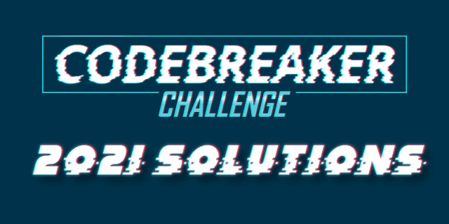

Please use the [Discussions](https://github.com/luker983/nsa-codebreaker-2021/discussions) page for questions and comments or reach out on Discord!

## Write-Ups

| Task  | Categories | Points |
|:-----:|:----------:|:------:|
| [0](task0/)   | Community of Practice, Discord Server     | 1     |
| [1](task1/)   | Network Forensics, Command Line           | 25    |
| [2](task2/)   | Log Analysis                              | 50    |
| [3](task3/)   | Email Analysis                            | 150   |
| [4](task4/)   | PowerShell, Registry Analysis             | 150   |
| [5](task5/)   | Docker Analysis                           | 300   |
| [6](task6/)   | Reverse Engineering                       | 500   |

### Solo Challenges

| Task  | Categories | Points |
|:-----:|:----------:|:------:|
| [7](task7/)   | Protocol Analysis                         | 500   |
| [8](task8/)   | Cryptanalysis                             | 3000  |
| [9](task9/)   | Protocol Analysis, Software Development   | 3500  |
| [10](task10/) | Protocol Analysis, Software Development, Exploit Development  | 5000  |

## Overview

> The 2021 Codebreaker Challenge consists of a series of tasks that are worth a varying amount of points based upon their difficulty. Schools will be ranked according to the total number of points accumulated by their students. Solutions may be submitted at any time for the duration of the Challenge.
>
> While not required, we recommend that you solve tasks in order, since they flow with the storyline. Later tasks may rely on artifacts / inputs from earlier tasks.
>
> Each task in this year's challenge will require a range of skills. We need you to call upon all of your technical expertise, your intuition, and your common sense.
>
> Good luck. We hope you enjoy the challenge!

## Background

> *DISCLAIMER - The following is a FICTITIOUS story meant for providing realistic context for the Codebreaker Challenge and is not tied in any way to actual events.*
> 
> ---
> 
> The Internet is home to many different cyber actors. To better prepare for and defend against these actors, NSA routinely investigates foreign cyber actors and their activities. During one such investigation, a new IP address was identified to be part of an unknown actor's infrastructure. NSA believes it is a [listening post](https://wiki.cbc.cybersecurity.nmt.edu/doku.php?id=listeningpost) (LP).
>
> ---
> 
> Note: All IP addresses have been anonymized.
