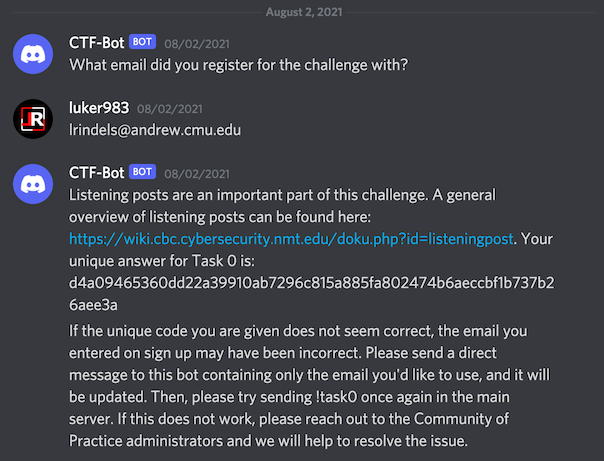
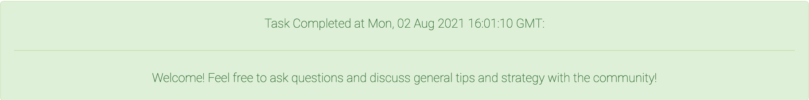

<div align="center">

# Task 0

[](https://shields.io/)
[](https://shields.io/)
</div>

> As a participant in the Codebreaker Challenge, you are invited to join New Mexico Tech’s Codebreaker Challenge Community of Practice!
> 
> We're piloting this community to provide Codebreaker Challenge participants and people interested in cybersecurity a place to talk about Codebreaker, cybersecurity, and other related topics. You should have received an invitation link to the Community Discord server in your confirmation email.
> 
> To complete this task, join the Discord server. Once there, type `!task0` in the chat. Follow the prompts, and paste the answer the bot gives you below.
> 
> Note: You must provide the bot with the email you used to register for the Challenge.
>
> ---
> 
> Provide the answer the bot gives you
> ```
> ```

## Files

* [solution.txt](solution.txt) - Solution

## Solution

When registering for the challenge, you have to provide and then confirm your email address. The confirmation email contains an invite link to join the Discord server.

There is a `bot-commands` text channel within the server where you can enter the command `!task0`. A bot will then request your email address and give you a code:

<div align="center">


</div>

Our sanity has been checked, now on to the fun stuff!  

<div align="center">


</div>
