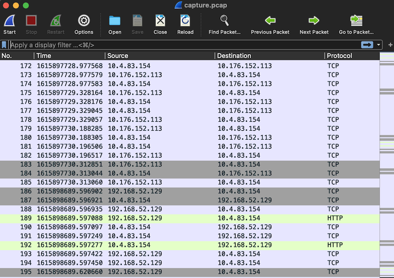

<div align="center">

# Task 1

[](https://shields.io/)
[](https://shields.io/)
</div>

> The NSA Cybersecurity Collaboration Center has a mission to prevent and eradicate threats to the US Defense Industrial Base (DIB). Based on information sharing agreements with several DIB companies, we need to determine if any of those companies are communicating with the actor's infrastructure.
> 
> You have been provided a capture of data en route to the listening post as well as a list of DIB company IP ranges. Identify any IPs associated with the DIB that have communicated with the LP.
> 
> Downloads:
> * [Network traffic heading to the LP (capture.pcap)](provided/capture.pcap)
> * [DIB IP address ranges (ip_ranges.txt)](provided/ip_ranges.txt)
> 
> ---
> 
> Enter the IP addresses associated with the DIB that have communicated with the LP, one per line
> ```
> ```

## Files

* [provided/](provided/)
  - [capture.pcap](provided/capture.pcap) - Provided capture of packets to the listening post
  - [ip_ranges.txt](provided/ip_ranges.txt) - Provided DIB IP ranges
* [ip_extractor.sh](ip_extractor.sh) - Extracts unique addresses from a packet capture
* [ips.txt](ips.txt) - Output of `ip_extractor.sh`
* [solve.py](solve.py) - Solve script
* [solution.txt](solution.txt) - Solution

## Solution

This task can be boiled down to *find every IP that is in both the PCAP and the IP ranges provided*.

If you don't understand the format of the IP address ranges, read through the Wikipedia page for [Classles Inter-Domain Routing](https://en.wikipedia.org/wiki/Classless_Inter-Domain_Routing), in particular the [CIDR notation](https://en.wikipedia.org/wiki/Classless_Inter-Domain_Routing#CIDR_notation) section. 

If there were only a few ranges or only a few packets it might be quicker to solve this task manually, but looking at `capture.pcap` in [Wireshark](https://www.wireshark.org/) pushed me to script a solution instead: 

<div align="center">


</div>

I figured there must be some python library out there that allows you to check if an IP address is within an IP range. Fortunately there is and it's called [`ipaddress`](https://docs.python.org/3/library/ipaddress.html). This library allows you to convert string representations of addresses and ranges (what we have) into `IPv4Address` and `IPv4Network` types that can be compared (what we want).

We have the ranges in a nice, line-separated format that should be easy to import into a script. We don't have the IP addresses from the PCAP in a nice format yet though. There are two command line utilities for PCAPs that should be up to that task: [`tshark`](https://www.wireshark.org/docs/man-pages/tshark.html) and [`tcpdump`](https://www.tcpdump.org/). One of the top search results I got was [this gist](https://gist.github.com/WJDigby/107f9330ad120ba4044c69e951cc953a) from [WJDigby](https://github.com/WJDigby) that uses `tcpdump`. I added some comments and a filename to get this result: 

```bash
$ tcpdump -r provided/capture.pcap 'ip' -n                      | # get IP data from pcap
    grep -E '[0-9]{1,3}\.[0-9]{1,3}\.[0-9]{1,3}\.[0-9]{1,3}' -o | # filter out everything except the addresses
    sort -u                                                       # remove duplicates
```
```
reading from file provided/capture.pcap, link-type EN10MB (Ethernet)
10.176.152.113
10.22.113.107
10.4.83.154
172.27.231.158
192.168.1.62
192.168.165.227
192.168.52.129
192.168.8.178
192.168.90.188
198.18.157.4
```

Great! Now we just need to load up the IPs and ranges, test to see if each IP is in any of the ranges, and print out the ones that are:

```python3
#!/usr/bin/env python3

import ipaddress

# read in allowed ip ranges
with open('provided/ip_ranges.txt', 'r') as f:
    ranges = f.readlines()

# read in ips from ip_extractor.sh
with open('ips.txt', 'r') as f:
    ips = f.readlines()

# convert to ip range and address types
ranges = [ipaddress.ip_network(r.strip()) for r in ranges]
ips = [ipaddress.ip_address(i.strip()) for i in ips]

# check if each ip is in any of the ranges
for i in ips:
    for r in ranges:
        if i in r:
            print(i)

```

Running this script yields the 4 addresses that fit the description and solve this task:

```
$ python3 solve.py
```
```
10.176.152.113
10.22.113.107
192.168.1.62
192.168.8.178
```

<div align="center">


</div>

## Resources

* [Wireshark](https://www.wireshark.org/)
* [Classles Inter-Domain Routing Notation](https://en.wikipedia.org/wiki/Classless_Inter-Domain_Routing#CIDR_notation)
* [`ipaddress`](https://docs.python.org/3/library/ipaddress.html)
* [`tshark`](https://www.wireshark.org/docs/man-pages/tshark.html)
* [`tcpdump`](https://www.tcpdump.org/)
* [`tcpdump` Extract IPs from PCAP](https://gist.github.com/WJDigby/107f9330ad120ba4044c69e951cc953a)
