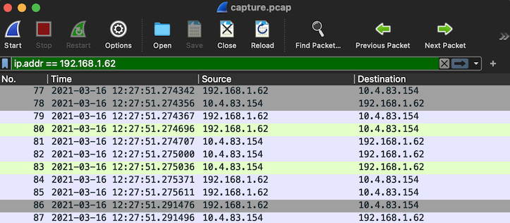
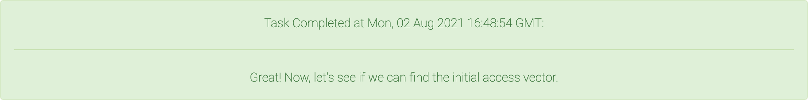

<div align="center">

# Task 2

[](https://shields.io/)
[](https://shields.io/)
</div>

> NSA notified FBI, which notified the potentially-compromised DIB Companies. The companies reported the compromise to the Defense Cyber Crime Center (DC3). One of them, Online Operations and Production Services (OOPS) requested FBI assistance. At the request of the FBI, we've agreed to partner with them in order to continue the investigation and understand the compromise.
> 
> OOPS is a cloud containerization provider that acts as a one-stop shop for hosting and launching all sorts of containers -- rkt, Docker, Hyper-V, and more. They have provided us with logs from their network proxy and domain controller that coincide with the time that their traffic to the cyber actor's listening post was captured.
> 
> Identify the logon ID of the user session that communicated with the malicious LP (i.e.: on the machine that sent the beacon *and* active at the time the beacon was sent).
> 
> 
> Downloads:
> * [Subnet associated with OOPS (oops_subnet.txt)](provided/oops_subnet.txt)
> * [Network proxy logs from Bluecoat server (proxy.log)](provided/proxy.log)
> * [Login data from domain controller (logins.json)](provided/logins.json)
> 
> ---
> 
> Enter the logon ID of the user session that communicated with the malicious LP
> ```
> ```
> 
> #### Task 2 Format
> 
> The answer for Task 2 is an integer. You can provide it in base 10 or base 16.
> 
> As an example, if you thought the logon ID was 0x1000, you could provide any of the following:
> * 0x1000
> * 0X1000
> * 4096

## Files

* [provided/](provided/)
  - [oops_subnet.txt](provided/oops_subnet.txt) - Provided OOPS subnet 
  - [proxy.log](provided/proxy.log) - Provided proxy logs 
  - [logins.json](provided/logins.json) - Provided logged logins 
* [interesting_proxy.log](interesting_proxy.log) - Proxy log generated by the LP session
* [interesting_login.json](interesting_login.json) - Login entry with the correct ID
* [solution.txt](solution.txt) - Solution

## Solution

In this task we need to build upon what we learned in the previous task by discovering which user/machine in the OOPS network was compromised.

### PCAP Conversation

`oops_subnet.txt` narrows down the compromised IPs from task 1 for us. Only one address matches this subnet:

```
                                                10.176.152.113
                                                10.22.113.107
192.168.1.48/28 -> 192.168.1.48-192.168.1.63 -> 192.168.1.62
                                                192.168.8.178
```

We can now search the packet capture for this conversation with the listening post. We're interested in two things:

1. The destination address of the Listening Post
2. The timestamp of the conversations between the OOPS subnet and the LP

The first can be addressed with a simple filter:

```
ip.addr == 192.168.1.62
```

The second is in the *Time* column by default, but we need to make sure we have a common timezone between all of our logs. To get the date and time in UTC, I used the following menu option:

*View > Time Display Format > UTC Date and Time of Day*

<div align="center">


</div>

We can now see that the LP address is `10.4.83.154` and the conversation occurs at `2021-03-16 12:27:51 UTC`. Using this information we can start searching the logs. Let's check out the format of each one.

### `proxy.log`

This log has the the fields defined at the top, with the values for each field space-separated in each line:

```bash
$ head -n 5 proxy.log
```
```
#Software: SGOS 6.7.5.3
#Version: 1.0
#Date: 2021-04-16 17:10:39 EST (UTC-0400)
#Fields: date time time-taken c-ip sc-status s-action sc-bytes cs-bytes cs-method cs-uri-scheme cs-host cs-uri-path cs-uri-query cs-username s-hierarchy s-supplier-name rs(Content-Type) cs(User-Agent) sc-filter-result sc-filter-category x-virus-id s-ip s-sitename x-virus-details x-icap-error-code x-icap-error-details
2021-03-16 06:39:00 48 10.19.212.192 200 TCP_CLIENT_REFRESH 525 406 GET http update.messenger.yahoo.com /msgrcli6.html - - DIRECT update.messenger.yahoo.com text/html 'Mozilla/5.0 (compatible; MSIE 9.0; Windows NT 6.1; WOW64; Trident/5.0; KTXN)' PROXIED Chat/Instant%20Messaging - 10.19.212.239 SG-HTTP-Service - none -
```

We could probably do some magic to output all of this in a nice way, but it isn't really necessary. There are clearly IP addresses and timestamps that we can use to search on. Let's see if the two IPs we know about show up:

```bash
$ grep "192.168.1.62\|10.4.83.154" proxy.log
```
```
2021-03-16 08:27:51 37 10.19.212.179 200 TCP_MISS 12734 479 GET http qerrb.invalid movement - - DIRECT 10.4.83.154 application/octet-stream 'Mozilla/4.0 (compatible; MSIE 6.0; Windows NT 5.1; SV1; .NET CLR 1.1.4322; .NET CLR 2.0.50727)' PROXIED none - 10.19.212.239 SG-HTTP-Service - none -
```

Exactly one entry comes up! The LP's address is in the `s-supplier-name` field. What does that mean? We can find out by searching for *bluecoat s-supplier-name*. The first result is a [ProxySG Log Fields and Substitutions](https://techdocs.broadcom.com/content/dam/broadcom/techdocs/symantec-security-software/web-and-network-security/proxysg/common/LogFieldsSubs.pdf) document that says this field is the:

> Hostname of the upstream host

From the other fields and how they match the Wireshark conversation it is clear that this is the correct log. The major differences are that the timestamp and source IP differ.

At the top of `proxy.log` we can see that this log uses `EST` time, which is 4 hours behind UTC. Adding 4 hours to the timestamp of our LP proxy log perfectly matches the one we found in Wireshark.

The source IP in the packet capture is probably the IP of the network proxy itself, and the true client IP is the `c-ip` field in this log entry: `10.19.212.179`. On to the next one.

### `logins.json`

The first entry in `logins.json` looks like this:

```bash
$ head -n 1 logins.json
```
```json
{"PayloadData1": "Target: OOPS\\collier.alfred", "PayloadData2": "ServiceName: krbtgt", "PayloadData3": "ServiceSid: S-1-5-21-3003753-709489717-5076134339-502", "PayloadData4": "TicketEncryptionType: AES256-CTS-HMAC-SHA1-96", "PayloadData5": "Status: KDC_ERR_NONE - No error - No errors were found.", "PayloadData6": "PreAuthType: PA-ENC-TIMESTAMP - This type is normal for standard password authentication.", "RemoteHost": "::ffff:10.19.212.192:23227", "MapDescription": "A Kerberos authentication ticket (TGT) was requested", "ChunkNumber": 0, "Computer": "OOPS-DC.oops.net", "Payload": "{\"EventData\": {\"Data\": [{\"@Name\": \"TargetUserName\", \"#text\": \"collier.alfred\"}, {\"@Name\": \"TargetDomainName\", \"#text\": \"OOPS\"}, {\"@Name\": \"TargetSid\", \"#text\": \"S-1-5-21-3003753-709489717-5076134339-1251\"}, {\"@Name\": \"ServiceName\", \"#text\": \"krbtgt\"}, {\"@Name\": \"ServiceSid\", \"#text\": \"S-1-5-21-3003753-709489717-5076134339-502\"}, {\"@Name\": \"TicketOptions\", \"#text\": \"0x40810010\"}, {\"@Name\": \"Status\", \"#text\": \"0x0\"}, {\"@Name\": \"TicketEncryptionType\", \"#text\": \"0x12\"}, {\"@Name\": \"PreAuthType\", \"#text\": \"2\"}, {\"@Name\": \"IpAddress\", \"#text\": \"::ffff:10.19.212.192\"}, {\"@Name\": \"IpPort\", \"#text\": \"23227\"}, {\"@Name\": \"CertIssuerName\"}, {\"@Name\": \"CertSerialNumber\"}, {\"@Name\": \"CertThumbprint\"}]}}", "Channel": "Security", "Provider": "Microsoft-Windows-Security-Auditing", "EventId": 4768, "EventRecordId": "5945", "ProcessId": 601, "ThreadId": 3802, "Level": "LogAlways", "Keywords": "Audit success", "SourceFile": "C:\\Windows\\system32\\winevt\\Logs\\Security.evtx", "ExtraDataOffset": 0, "HiddenRecord": false, "TimeCreated": "2021-03-16T10:36:08.1210713+00:00", "RecordNumber": "5945"
```

This is not very readable, but it is in [JSON](https://en.wikipedia.org/wiki/JSON) format. This means we can pipe it into a utility called [`jq`](https://stedolan.github.io/jq/) that will pretty-print the logs:

```bash
$ head -n 1 logins.json | jq
```
```json
{
  "PayloadData1": "Target: OOPS\\collier.alfred",
  "PayloadData2": "ServiceName: krbtgt",
  "PayloadData3": "ServiceSid: S-1-5-21-3003753-709489717-5076134339-502",
  "PayloadData4": "TicketEncryptionType: AES256-CTS-HMAC-SHA1-96",
  "PayloadData5": "Status: KDC_ERR_NONE - No error - No errors were found.",
  "PayloadData6": "PreAuthType: PA-ENC-TIMESTAMP - This type is normal for standard password authentication.",
  "RemoteHost": "::ffff:10.19.212.192:23227",
  "MapDescription": "A Kerberos authentication ticket (TGT) was requested",
  "ChunkNumber": 0,
  "Computer": "OOPS-DC.oops.net",
  "Payload": "{\"EventData\": {\"Data\": [{\"@Name\": \"TargetUserName\", \"#text\": \"collier.alfred\"}, {\"@Name\": \"TargetDomainName\", \"#text\": \"OOPS\"}, {\"@Name\": \"TargetSid\", \"#text\": \"S-1-5-21-3003753-709489717-5076134339-1251\"}, {\"@Name\": \"ServiceName\", \"#text\": \"krbtgt\"}, {\"@Name\": \"ServiceSid\", \"#text\": \"S-1-5-21-3003753-709489717-5076134339-502\"}, {\"@Name\": \"TicketOptions\", \"#text\": \"0x40810010\"}, {\"@Name\": \"Status\", \"#text\": \"0x0\"}, {\"@Name\": \"TicketEncryptionType\", \"#text\": \"0x12\"}, {\"@Name\": \"PreAuthType\", \"#text\": \"2\"}, {\"@Name\": \"IpAddress\", \"#text\": \"::ffff:10.19.212.192\"}, {\"@Name\": \"IpPort\", \"#text\": \"23227\"}, {\"@Name\": \"CertIssuerName\"}, {\"@Name\": \"CertSerialNumber\"}, {\"@Name\": \"CertThumbprint\"}]}}",
  "Channel": "Security",
  "Provider": "Microsoft-Windows-Security-Auditing",
  "EventId": 4768,
  "EventRecordId": "5945",
  "ProcessId": 601,
  "ThreadId": 3802,
  "Level": "LogAlways",
  "Keywords": "Audit success",
  "SourceFile": "C:\\Windows\\system32\\winevt\\Logs\\Security.evtx",
  "ExtraDataOffset": 0,
  "HiddenRecord": false,
  "TimeCreated": "2021-03-16T10:36:08.1210713+00:00",
  "RecordNumber": "5945"
}
```

This is much better, but we still have some messy data there in the *Payload* field. We can format that too by telling `jq` it's also JSON:

```bash
$ head -n 1 logins.json | jq '.Payload | fromjson'
```
```json
{
  "EventData": {
    "Data": [
      {
        "@Name": "TargetUserName",
        "#text": "collier.alfred"
      },
      {
        "@Name": "TargetDomainName",
        "#text": "OOPS"
      },
      {
        "@Name": "TargetSid",
        "#text": "S-1-5-21-3003753-709489717-5076134339-1251"
      },
      {
        "@Name": "ServiceName",
        "#text": "krbtgt"
      },
      {
        "@Name": "ServiceSid",
        "#text": "S-1-5-21-3003753-709489717-5076134339-502"
      },
      {
        "@Name": "TicketOptions",
        "#text": "0x40810010"
      },
      {
        "@Name": "Status",
        "#text": "0x0"
      },
      {
        "@Name": "TicketEncryptionType",
        "#text": "0x12"
      },
      {
        "@Name": "PreAuthType",
        "#text": "2"
      },
      {
        "@Name": "IpAddress",
        "#text": "::ffff:10.19.212.192"
      },
      {
        "@Name": "IpPort",
        "#text": "23227"
      },
      {
        "@Name": "CertIssuerName"
      },
      {
        "@Name": "CertSerialNumber"
      },
      {
        "@Name": "CertThumbprint"
      }
    ]
  }
}
```

There are some IPs and timestamps here. Let's try searching for the client IP address we found in `proxy.log`: 

```bash
$ grep "10.19.212.179" logins.json
```
```json
{"PayloadData1": "Target: OOPS\\calderon.elizabeth", "PayloadData2": "ServiceName: krbtgt", "PayloadData3": "ServiceSid: S-1-5-21-3003753-709489717-5076134339-502", "PayloadData4": "TicketEncryptionType: AES256-CTS-HMAC-SHA1-96", "PayloadData5": "Status: KDC_ERR_NONE - No error - No errors were found.", "PayloadData6": "PreAuthType: PA-ENC-TIMESTAMP - This type is normal for standard password authentication.", "RemoteHost": "::ffff:10.19.212.179:43889", "MapDescription": "A Kerberos authentication ticket (TGT) was requested", "ChunkNumber": 0, "Computer": "OOPS-DC.oops.net", "Payload": "{\"EventData\": {\"Data\": [{\"@Name\": \"TargetUserName\", \"#text\": \"calderon.elizabeth\"}, {\"@Name\": \"TargetDomainName\", \"#text\": \"OOPS\"}, {\"@Name\": \"TargetSid\", \"#text\": \"S-1-5-21-3003753-709489717-5076134339-1224\"}, {\"@Name\": \"ServiceName\", \"#text\": \"krbtgt\"}, {\"@Name\": \"ServiceSid\", \"#text\": \"S-1-5-21-3003753-709489717-5076134339-502\"}, {\"@Name\": \"TicketOptions\", \"#text\": \"0x40810010\"}, {\"@Name\": \"Status\", \"#text\": \"0x0\"}, {\"@Name\": \"TicketEncryptionType\", \"#text\": \"0x12\"}, {\"@Name\": \"PreAuthType\", \"#text\": \"2\"}, {\"@Name\": \"IpAddress\", \"#text\": \"::ffff:10.19.212.179\"}, {\"@Name\": \"IpPort\", \"#text\": \"43889\"}, {\"@Name\": \"CertIssuerName\"}, {\"@Name\": \"CertSerialNumber\"}, {\"@Name\": \"CertThumbprint\"}]}}", "Channel": "Security", "Provider": "Microsoft-Windows-Security-Auditing", "EventId": 4768, "EventRecordId": "6123", "ProcessId": 601, "ThreadId": 7254, "Level": "LogAlways", "Keywords": "Audit success", "SourceFile": "C:\\Windows\\system32\\winevt\\Logs\\Security.evtx", "ExtraDataOffset": 0, "HiddenRecord": false, "TimeCreated": "2021-03-16T11:17:32.2070947+00:00", "RecordNumber": "6123"}
{"PayloadData1": "Target: OOPS.NET\\calderon.elizabeth@OOPS.NET", "PayloadData2": "ServiceName: OOPS-WORKSTATION_4$", "PayloadData3": "ServiceSid: S-1-5-21-3003753-709489717-5076134339-1131", "PayloadData4": "TicketEncryptionType: AES256-CTS-HMAC-SHA1-96", "PayloadData5": "Status: KDC_ERR_NONE - No error - No errors were found.", "RemoteHost": "::ffff:10.19.212.179:43890", "MapDescription": "A Kerberos service ticket was requested", "ChunkNumber": 0, "Computer": "OOPS-DC.oops.net", "Payload": "{\"EventData\": {\"Data\": [{\"@Name\": \"TargetUserName\", \"#text\": \"calderon.elizabeth@OOPS.NET\"}, {\"@Name\": \"TargetDomainName\", \"#text\": \"OOPS.NET\"}, {\"@Name\": \"ServiceName\", \"#text\": \"OOPS-WORKSTATION_4$\"}, {\"@Name\": \"ServiceSid\", \"#text\": \"S-1-5-21-3003753-709489717-5076134339-1131\"}, {\"@Name\": \"TicketOptions\", \"#text\": \"0x40810000\"}, {\"@Name\": \"TicketEncryptionType\", \"#text\": \"0x12\"}, {\"@Name\": \"IpAddress\", \"#text\": \"::ffff:10.19.212.179\"}, {\"@Name\": \"IpPort\", \"#text\": \"43890\"}, {\"@Name\": \"Status\", \"#text\": \"0x0\"}, {\"@Name\": \"LogonGuid\", \"#text\": \"1a677787-4205-4a33-982b-0e3a8093b285\"}, {\"@Name\": \"TransmittedServices\", \"#text\": \"-\"}]}}", "Channel": "Security", "Provider": "Microsoft-Windows-Security-Auditing", "EventId": 4769, "EventRecordId": "6125", "ProcessId": 601, "ThreadId": 6011, "Level": "LogAlways", "Keywords": "Audit success", "SourceFile": "C:\\Windows\\system32\\winevt\\Logs\\Security.evtx", "ExtraDataOffset": 0, "HiddenRecord": false, "TimeCreated": "2021-03-16T11:17:32.2509543+00:00", "RecordNumber": "6125"}
{"PayloadData1": "Target: OOPS.NET\\calderon.elizabeth@OOPS.NET", "PayloadData2": "ServiceName: OOPS-DC$", "PayloadData3": "ServiceSid: S-1-5-21-3003753-709489717-5076134339-1000", "PayloadData4": "TicketEncryptionType: AES256-CTS-HMAC-SHA1-96", "PayloadData5": "Status: KDC_ERR_NONE - No error - No errors were found.", "RemoteHost": "::ffff:10.19.212.179:43891", "MapDescription": "A Kerberos service ticket was requested", "ChunkNumber": 0, "Computer": "OOPS-DC.oops.net", "Payload": "{\"EventData\": {\"Data\": [{\"@Name\": \"TargetUserName\", \"#text\": \"calderon.elizabeth@OOPS.NET\"}, {\"@Name\": \"TargetDomainName\", \"#text\": \"OOPS.NET\"}, {\"@Name\": \"ServiceName\", \"#text\": \"OOPS-DC$\"}, {\"@Name\": \"ServiceSid\", \"#text\": \"S-1-5-21-3003753-709489717-5076134339-1000\"}, {\"@Name\": \"TicketOptions\", \"#text\": \"0x40800000\"}, {\"@Name\": \"TicketEncryptionType\", \"#text\": \"0x12\"}, {\"@Name\": \"IpAddress\", \"#text\": \"::ffff:10.19.212.179\"}, {\"@Name\": \"IpPort\", \"#text\": \"43891\"}, {\"@Name\": \"Status\", \"#text\": \"0x0\"}, {\"@Name\": \"LogonGuid\", \"#text\": \"eb8663b3-67d4-4ae0-81df-5a4efbae45d1\"}, {\"@Name\": \"TransmittedServices\", \"#text\": \"-\"}]}}", "Channel": "Security", "Provider": "Microsoft-Windows-Security-Auditing", "EventId": 4769, "EventRecordId": "6126", "ProcessId": 601, "ThreadId": 6011, "Level": "LogAlways", "Keywords": "Audit success", "SourceFile": "C:\\Windows\\system32\\winevt\\Logs\\Security.evtx", "ExtraDataOffset": 0, "HiddenRecord": false, "TimeCreated": "2021-03-16T11:17:33.3032835+00:00", "RecordNumber": "6126"}
...
```

Wow, lots of login entries match this IP. How many exactly?

```bash
$ grep "10.19.212.179" logins.json | wc -l
```
```
      54
```

Hmmm, that's a lot. Before we try filtering this down further we can also try looking at the timestamps of the logs:

```bash
$ cat logins.json | jq '.TimeCreated'
```
```
...
"2021-03-16T11:54:53.8111052+00:00"
"2021-03-16T12:07:42.1849060+00:00"
"2021-03-16T12:07:42.2128498+00:00"
"2021-03-16T12:07:43.2740926+00:00"
"2021-03-16T12:07:43.3545300+00:00"
"2021-03-16T12:07:43.3841032+00:00"
"2021-03-16T12:07:43.4685013+00:00"
"2021-03-16T12:07:43.5398717+00:00"
"2021-03-16T12:07:43.5601292+00:00"
"2021-03-16T12:07:46.6379401+00:00"
"2021-03-16T12:07:46.6657964+00:00"
"2021-03-16T12:07:46.7337326+00:00"
"2021-03-16T12:07:46.7950322+00:00"
"2021-03-16T12:07:46.8175302+00:00"
"2021-03-16T12:07:46.8894128+00:00"
"2021-03-16T12:07:46.9516847+00:00"
"2021-03-16T12:07:46.9897626+00:00"
"2021-03-16T12:07:47.0275228+00:00"
"2021-03-16T12:07:47.0536669+00:00"
"2021-03-16T12:07:47.1138773+00:00"
"2021-03-16T12:07:47.1969706+00:00"
"2021-03-16T12:07:47.2383604+00:00"
"2021-03-16T12:07:47.2631516+00:00"
"2021-03-16T12:07:47.3537913+00:00"
"2021-03-16T12:14:45.3353495+00:00"
"2021-03-16T12:14:45.3783427+00:00"
"2021-03-16T12:14:46.4137025+00:00"
"2021-03-16T12:14:46.5026953+00:00"
"2021-03-16T12:14:46.5479455+00:00"
"2021-03-16T12:14:46.5761870+00:00"
"2021-03-16T12:14:46.6129407+00:00"
"2021-03-16T12:14:46.6554380+00:00"
"2021-03-16T12:14:49.7052048+00:00"
"2021-03-16T12:14:49.7699474+00:00"
"2021-03-16T12:14:49.7979408+00:00"
"2021-03-16T12:14:49.8229327+00:00"
"2021-03-16T12:14:49.8951139+00:00"
"2021-03-16T12:14:49.9253494+00:00"
"2021-03-16T12:14:49.9699351+00:00"
"2021-03-16T12:14:49.9998477+00:00"
"2021-03-16T12:14:50.0655826+00:00"
"2021-03-16T12:14:50.1543917+00:00"
"2021-03-16T12:14:50.1935179+00:00"
"2021-03-16T12:14:50.2555503+00:00"
"2021-03-16T12:14:50.2966918+00:00"
"2021-03-16T12:14:50.3464688+00:00"
"2021-03-16T12:14:50.3762863+00:00"
"2021-03-16T12:20:25.2914282+00:00"
"2021-03-16T12:20:55.3368732+00:00"
"2021-03-16T12:20:55.3563600+00:00"
"2021-03-16T12:20:55.4329160+00:00"
"2021-03-16T12:21:07.5118318+00:00"
"2021-03-16T12:49:20.4146617+00:00"
...
```

There are only a few logs around the time the beacon was sent. Let's see what the event types were during the 12th hour:

```bash
$ cat logins.json | grep "T12" | jq '.MapDescription'
```
```
"A Kerberos authentication ticket (TGT) was requested"
"A Kerberos service ticket was requested"
"A Kerberos service ticket was requested"
"Successful logon"
"Successful logon"
"Successful logon"
"An account was logged off"
"An account was logged off"
"A Kerberos service ticket was requested"
"A Kerberos service ticket was requested"
"Successful logon"
"Successful logon"
"Successful logon"
"An account was logged off"
"An account was logged off"
"An account was logged off"
"A Kerberos service ticket was requested"
"Successful logon"
"Successful logon"
"Successful logon"
"An account was logged off"
"An account was logged off"
"An account was logged off"
"A Kerberos authentication ticket (TGT) was requested"
"A Kerberos service ticket was requested"
"A Kerberos service ticket was requested"
"Successful logon"
"Successful logon"
"Successful logon"
"An account was logged off"
"An account was logged off"
"A Kerberos service ticket was requested"
"A Kerberos service ticket was requested"
"Successful logon"
"Successful logon"
"Successful logon"
"An account was logged off"
"An account was logged off"
"An account was logged off"
"A Kerberos service ticket was requested"
"Successful logon"
"Successful logon"
"Successful logon"
"An account was logged off"
"An account was logged off"
"An account was logged off"
"An account was logged off"
"A Kerberos service ticket was requested"
"A Kerberos service ticket was requested"
"Successful logon"
"An account was logged off"
"A Kerberos authentication ticket (TGT) was requested"
"A Kerberos service ticket was requested"
"A Kerberos service ticket was requested"
"Successful logon"
"Successful logon"
"Successful logon"
"An account was logged off"
"An account was logged off"
"A Kerberos service ticket was requested"
"A Kerberos service ticket was requested"
"Successful logon"
"Successful logon"
"Successful logon"
"An account was logged off"
"An account was logged off"
"An account was logged off"
"A Kerberos service ticket was requested"
"Successful logon"
"Successful logon"
"Successful logon"
"An account was logged off"
"An account was logged off"
"An account was logged off"
```

Lots of accounts are logging on *and* off. Unfortunately, logoff events do not contain an IP address so it's a little harder to filter out the events we don't care about. At this point it's easier to print out the fields we care about and manually determine which logon IDs are left at the time when the beacon is sent:

```bash
$ cat logins.json | grep "T12" | jq '{ type: .MapDescription, id: .PayloadData3, time: .TimeCreated }'
```
```json
...
{
  "type": "Successful logon",
  "id": "LogonId: 0X2CA9EA",
  "time": "2021-03-16T12:49:25.3472706+00:00"
}
{
  "type": "Successful logon",
  "id": "LogonId: 0X2CA9FB",
  "time": "2021-03-16T12:49:25.3907955+00:00"
}
{
  "type": "Successful logon",
  "id": "LogonId: 0X2CAA20",
  "time": "2021-03-16T12:49:25.4153308+00:00"
}
{
  "type": "An account was logged off",
  "id": "LogonId: 0X2CAA20",
  "time": "2021-03-16T12:49:25.4490936+00:00"
}
{
  "type": "An account was logged off",
  "id": "LogonId: 0X2CA9FB",
  "time": "2021-03-16T12:49:25.5033961+00:00"
}
...
```

In this small segment of the results, we can see that `0x2CAA20` is logged on and then logged off. We can now remove that ID from consideration. Applying this strategy to all logons starting from `12:00:00 UTC` to `12:27:51 UTC` produces the following two IDs:

```
0x2CA22A
0x2CA839
``` 

The hope is that one of these will have the IP address we care about:

```bash
$ cat logins.json | grep "2CA22A\|2CA839" | grep "10.19.212.179" | jq 
```
```json
{
  "PayloadData1": "Target: OOPS.NET\\binder.debbra",
  "PayloadData2": "LogonType 3",
  "PayloadData3": "LogonId: 0X2CA22A",
  "UserName": "-\\-",
  "RemoteHost": "- (10.19.212.179)",
  "ExecutableInfo": "-",
  "MapDescription": "Successful logon",
  "ChunkNumber": 0,
  "Computer": "OOPS-DC.oops.net",
  "Payload": "{\"EventData\": {\"Data\": [{\"@Name\": \"SubjectUserSid\", \"#text\": \"S-1-0-0\"}, {\"@Name\": \"SubjectUserName\", \"#text\": \"-\"}, {\"@Name\": \"SubjectDomainName\", \"#text\": \"-\"}, {\"@Name\": \"SubjectLogonId\", \"#text\": \"0x0\"}, {\"@Name\": \"TargetUserSid\", \"#text\": \"S-1-5-21-3003753-709489717-5076134339-1232\"}, {\"@Name\": \"TargetUserName\", \"#text\": \"binder.debbra\"}, {\"@Name\": \"TargetDomainName\", \"#text\": \"OOPS.NET\"}, {\"@Name\": \"TargetLogonId\", \"#text\": \"0X2CA22A\"}, {\"@Name\": \"LogonType\", \"#text\": \"3\"}, {\"@Name\": \"LogonProcessName\", \"#text\": \"Kerberos\"}, {\"@Name\": \"AuthenticationPackageName\", \"#text\": \"Kerberos\"}, {\"@Name\": \"WorkstationName\", \"#text\": \"-\"}, {\"@Name\": \"LogonGuid\", \"#text\": \"ac1d7f42-3bfc-47c0-b1f7-8fa11587a89d\"}, {\"@Name\": \"TransmittedServices\", \"#text\": \"-\"}, {\"@Name\": \"LmPackageName\", \"#text\": \"-\"}, {\"@Name\": \"KeyLength\", \"#text\": \"0\"}, {\"@Name\": \"ProcessId\", \"#text\": \"0x0\"}, {\"@Name\": \"ProcessName\", \"#text\": \"-\"}, {\"@Name\": \"IpAddress\", \"#text\": \"10.19.212.179\"}, {\"@Name\": \"IpPort\", \"#text\": \"43866\"}, {\"@Name\": \"ImpersonationLevel\", \"#text\": \"%%1833\"}, {\"@Name\": \"RestrictedAdminMode\", \"#text\": \"-\"}, {\"@Name\": \"TargetOutboundUserName\", \"#text\": \"-\"}, {\"@Name\": \"TargetOutboundDomainName\", \"#text\": \"-\"}, {\"@Name\": \"VirtualAccount\", \"#text\": \"%%1843\"}, {\"@Name\": \"TargetLinkedLogonId\", \"#text\": \"0x0\"}, {\"@Name\": \"ElevatedToken\", \"#text\": \"%%1842\"}]}}",
  "Channel": "Security",
  "Provider": "Microsoft-Windows-Security-Auditing",
  "EventId": 4624,
  "EventRecordId": "6332",
  "ProcessId": 601,
  "ThreadId": 3220,
  "Level": "LogAlways",
  "Keywords": "Audit success",
  "SourceFile": "C:\\Windows\\system32\\winevt\\Logs\\Security.evtx",
  "ExtraDataOffset": 0,
  "HiddenRecord": false,
  "TimeCreated": "2021-03-16T12:07:43.3545300+00:00",
  "RecordNumber": "6332"
}
```

That worked! We narrowed it down to one session and can submit the ID `0x2CA22A`.

<div align="center">


</div>

## Resources

* [ProxySG Log Fields and Substitutions](https://techdocs.broadcom.com/content/dam/broadcom/techdocs/symantec-security-software/web-and-network-security/proxysg/common/LogFieldsSubs.pdf)
* [JSON](https://en.wikipedia.org/wiki/JSON)
* [`jq`](https://stedolan.github.io/jq/)
