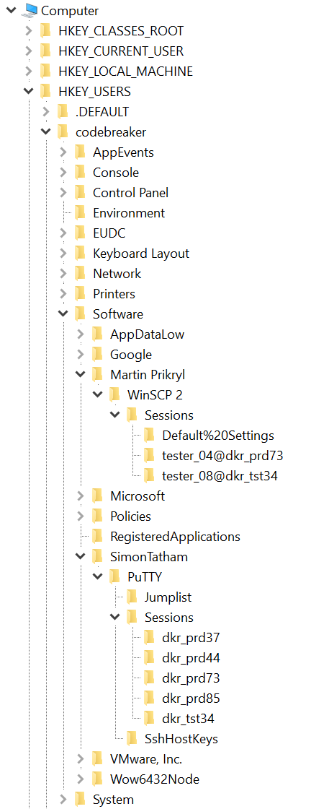
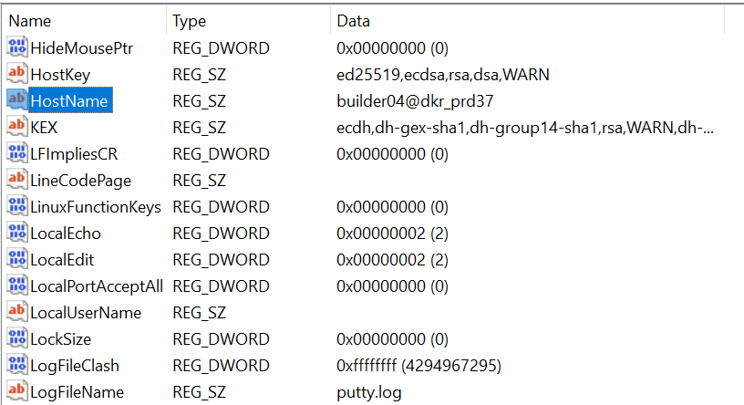
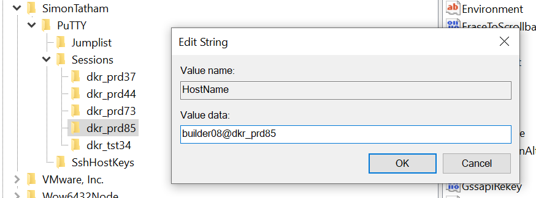

<div align="center">

# Task 4

[](https://shields.io/)
[](https://shields.io/)
</div>

> A number of OOPS employees fell victim to the same attack, and we need to figure out what's been compromised! Examine the malware more closely to understand what it's doing. Then, use these artifacts to determine which account on the OOPS network has been compromised.
> 
> Downloads:
> * [OOPS forensic artifacts (artifacts.zip)](provided/artifacts.zip)
> 
> ---
> 
> Enter the name of the machine the attackers can now access
> ```
> ```
> 
> Enter the username the attackers can use to access that machine
> ```
> ```

## Files

* [provided/](provided/)
  - [artifacts.zip](provided/artifacts.zip) - Provided artifacts
    - NTUSER.DAT - User registry file
    - dkt_prd37.ppk - PuTTY private key file
    - dkt_prd37.pub - PuTTY public key file
    - ...
* [solution.txt](solution.txt) - Solution

## Solution

Ignoring the artifacts for now, let's start by understanding the PowerShell payload from the last task. Even without much PowerShell knowledge we should be able to get a good idea of what's going on because it's fairly well commented.

The comments from the main `Invoke-SessionGopher` function give us a basic roadmap:

```
# Aggregate all user hives in HKEY_USERS into a variable
# For each SID beginning in S-15-21-. Loops through each user hive in HKEY_USERS.
# For each Hive in UserHives
    # Created for each user found. Contains all PuTTY, WinSCP, FileZilla, RDP information.
    # Construct PuTTY, WinSCP, RDP, FileZilla session paths from base key
    # If (Test-Path WinSCPPath)
        # Aggregates all saved sessions from that user's WinSCP client
    # If (Test-Path PuTTYPath)
        # Store .ppk files
        # Aggregates all saved sessions from that user's PuTTY client
```

This script seems to collect PuTTY, WinSCP, FileZilla, and RDP information from user registry hives and then sends it all to the LP. Now let's see what the artifact zip contains:

```bash
$ unzip artifacts.zip
```
```
Archive:  artifacts.zip
  inflating: dkr_tst89.pub
  inflating: dkr_prd44.pub
  inflating: dkr_tst51.pub
  inflating: dkr_prd85.pub
  inflating: dkr_prd85.ppk
  inflating: dkr_tst87.ppk
  inflating: dkr_prd37.ppk
  inflating: NTUSER.DAT
  inflating: dkr_tst75.ppk
  inflating: dkr_tst34.pub
  inflating: dkr_tst87.pub
  inflating: dkr_prd73.ppk
  inflating: dkr_prd73.pub
  inflating: dkr_tst34.ppk
  inflating: dkr_tst51.ppk
  inflating: dkr_tst89.ppk
  inflating: dkr_tst75.pub
  inflating: dkr_prd44.ppk
  inflating: dkr_prd37.pub
```

Let's figure out what these files are:

```bash
file *
```
```
NTUSER.DAT:    MS Windows registry file, NT/2000 or above
artifacts.zip: Zip archive data, at least v2.0 to extract
dkr_prd37.ppk: PuTTY Private Key File, version 2, algorithm ssh-rsa, Encryption aes256-cbc "__COMP1__"
dkr_prd37.pub: ASCII text, with CRLF line terminators
dkr_prd44.ppk: PuTTY Private Key File, version 2, algorithm ssh-rsa, Encryption aes256-cbc "__COMP2__"
dkr_prd44.pub: ASCII text, with CRLF line terminators
dkr_prd73.ppk: PuTTY Private Key File, version 2, algorithm ssh-rsa, Encryption aes256-cbc "__COMP3__"
dkr_prd73.pub: ASCII text, with CRLF line terminators
dkr_prd85.ppk: PuTTY Private Key File, version 2, algorithm ssh-rsa, Encryption none "__COMP4__"
dkr_prd85.pub: ASCII text, with CRLF line terminators
dkr_tst34.ppk: PuTTY Private Key File, version 2, algorithm ssh-rsa, Encryption aes256-cbc "__COMP5__"
dkr_tst34.pub: ASCII text, with CRLF line terminators
dkr_tst51.ppk: PuTTY Private Key File, version 2, algorithm ssh-rsa, Encryption none "__COMP6__"
dkr_tst51.pub: ASCII text, with CRLF line terminators
dkr_tst75.ppk: PuTTY Private Key File, version 2, algorithm ssh-rsa, Encryption none "__COMP7__"
dkr_tst75.pub: ASCII text, with CRLF line terminators
dkr_tst87.ppk: PuTTY Private Key File, version 2, algorithm ssh-rsa, Encryption none "__COMP8__"
dkr_tst87.pub: ASCII text, with CRLF line terminators
dkr_tst89.ppk: PuTTY Private Key File, version 2, algorithm ssh-rsa, Encryption none "__COMP9__"
dkr_tst89.pub: ASCII text, with CRLF line terminators
```

This is very interesting. According to Microsoft's documentation for [Registry Hives](https://docs.microsoft.com/en-us/windows/win32/sysinfo/registry-hives), `NTUSER.DAT` is a supporting file for the `HKEY_CURRENT_USER` hive. This must be one of the hives that the PowerShell script enumerates. 

The rest are [PuTTY](https://putty.org/) private and public keys. Before Windows added WSL and a native SSH client, PuTTY was *the* unofficial Windows SSH client. The most interesting thing here is that COMP 4, 6, 7, 8, and 9 are not encrypted. Keep that in mind moving forward. 

Now we need to explore `NTUSER.DAT`. There are a ton of tools that do this well, but a really easy method if you already have a Windows machine is to load the file into the native Registry Editor app:

1. Click `HKEY_USERS`
2. Click *File > Load Hive*
3. Select the `NTUSER.DAT` file
4. Provide a name (e.g., `codebreaker`)

Now we can explore the file as if it were a user on our system. It can be daunting to look at registry hives because there are so many values that may or may not be relevant. We can take it one step at a time by expanding the sections that we know the script looked at:

<div align="center">


</div>

Notice that we have PuTTY keys that correspond to each one of these sessions, but not every key has a corresponding session. To get the username and machine name, we're going to need some more information. Let's dive into the keys and values of the first PuTTY session:  

<div align="center">


</div>

This looks just like the `username@hostname` format that SSH uses! We can now infer that the PuTTY key filenames are the machine names and what comes before the `@` in the `HostName` registry value is a username. However, `dkr_prd37.ppk` we know is encrypted. We (and the attackers) can't use the private key unless we know the passphrase so this probably isn't our solution.

Are there any sessions that match unencrypted keys? Yes. Only one:

<div align="center">


</div>

The attacker would have access to the private and public key of user `builder08` and know the machine it's used to connect to: `dkr_prd85`. This must be the compromised account!

<div align="center">


</div>

## Resources

* [Registry Hives](https://docs.microsoft.com/en-us/windows/win32/sysinfo/registry-hives)
* [PuTTY](https://putty.org/)
