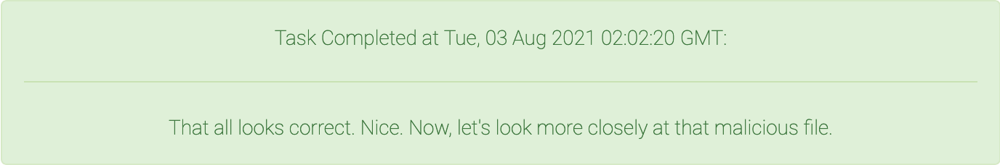

<div align="center">

# Task 5

[](https://shields.io/)
[](https://shields.io/)
</div>

> A forensic analysis of the server you identified reveals suspicious logons shortly after the malicious emails were sent. Looks like the actor moved deeper into OOPS' network. Yikes.
> 
> The server in question maintains OOPS' Docker image registry, which is populated with images created by OOPS clients. The images are all still there (phew!), but one of them has a recent modification date: an image created by the Prevention of Adversarial Network Intrusions Conglomerate (PANIC).
> 
> Due to the nature of PANIC's work, they have a close partnership with the FBI. They've also long been a target of both government and corporate espionage, and they invest heavily in security measures to prevent access to their proprietary information and source code.
> 
> The FBI, having previously worked with PANIC, have taken the lead in contacting them. The FBI notified PANIC of the potential compromise and reminded them to make a report to DC3. During conversations with PANIC, the FBI learned that the image in question is part of their nightly build and test pipeline. PANIC reported that nightly build and regression tests had been taking longer than usual, but they assumed it was due to resourcing constraints on OOPS' end. PANIC consented to OOPS providing FBI with a copy of the Docker image in question.
> 
> Analyze the provided Docker image and identify the actor's techniques.
> 
> Downloads: 
> * [PANIC Nightly Build + Test Docker Image (image.tar)](provided/image.tar)
> 
> ---
> 
> Enter the email of the PANIC employee who maintains the image
> ```
> ```
> 
> Enter the URL of the repository cloned when this image runs
> ```
> ```
> 
> Enter the full path to the malicious file present in the image
> ```
> ```
> 
> ---
> 
> #### Task 5 Note
> 
> The full path requested in Task 5 is a file present in the Docker image.
> 
> You do not need the contents of the cloned Git repository.


## Files

***Note**: To download `image.tar`, you will need to install [Git LFS](https://git-lfs.github.com/) and run `git lfs pull`*

* [provided/](provided/)
  - [image.tar](provided/image.tar) - Provided container tarfile
* [strace.out](strace.out) - Result of `strace make` within the Docker container.
* [solution.txt](solution.txt) - Solution

## Solution

If it's not already installed, now is a good time to get [Docker](https://www.docker.com/).

We could try manually untarring the provided file and combing through the contents (a mistake I made when starting this task), but Docker does a much better job of this. [`docker load`](https://docs.docker.com/engine/reference/commandline/load/) allows us to import an image from a file, so let's do that. 

```bash
$ docker load --input image.tar
```
```
fa9e6c566cf5: Loading layer [==================================================>]  20.24MB/20.24MB
806f5a5fdb09: Loading layer [==================================================>]  376.4MB/376.4MB
648f3e025747: Loading layer [==================================================>]  3.072kB/3.072kB
7b6855174778: Loading layer [==================================================>]  3.584kB/3.584kB
af251fe09b33: Loading layer [==================================================>]  3.584kB/3.584kB
Loaded image: panic-nightly-test:latest
```

### Maintainer

This looks promising, let's see what kind of metadata this image stores:


```bash
$ docker inspect panic-nightly-test:latest
```
```json
[
    {
        "Id": "sha256:416518f268606f59309000e46644f3b7ddd2683f56f2e350ebba23a4c29fae81",
        "RepoTags": [
            "panic-nightly-test:latest"
        ],
        "RepoDigests": [],
        "Parent": "",
        "Comment": "",
        "Created": "2021-03-28T04:49:29.200302Z",
        "Container": "cf822ed7eba5c2ede93a20dcef10d97190666a37d7b081a1de7d5eb4ab886323",
        "ContainerConfig": {
            "Hostname": "cf822ed7eba5",
            "Domainname": "",
            "User": "",
            "AttachStdin": false,
            "AttachStdout": false,
            "AttachStderr": false,
            "Tty": false,
            "OpenStdin": false,
            "StdinOnce": false,
            "Env": [
                "PATH=/usr/local/sbin:/usr/local/bin:/usr/sbin:/usr/bin:/sbin:/bin"
            ],
            "Cmd": [
                "/bin/sh",
                "-c",
                "#(nop) ",
                "LABEL docker.cmd.build=docker build --no-cache=true --build-arg BUILD_DATE=$(date -u +'%Y-%m-%dT%H:%M:%SZ') --build-arg VCS_REF=$(git log -n 1 --abbrev-commit --pretty='%H') ."
            ],
            "Image": "sha256:bffb2f74e0803c0176c698e4054f0da27f6fcb28204b03bff0b23ab59e68e011",
            "Volumes": null,
            "WorkingDir": "/usr/local/src",
            "Entrypoint": null,
            "OnBuild": null,
            "Labels": {
                "docker.cmd.build": "docker build --no-cache=true --build-arg BUILD_DATE=$(date -u +'%Y-%m-%dT%H:%M:%SZ') --build-arg VCS_REF=$(git log -n 1 --abbrev-commit --pretty='%H') .",
                "maintainer": "weber.theresa@panic.invalid",
                "org.opencontainers.image.author": "Theresa Weber",
                "org.opencontainers.image.created": "2021-03-28T04:49:29Z",
                "org.opencontainers.image.description": "Build and tests container for PANIC. Runs nightly.",
                "org.opencontainers.image.revision": "be3d94bc8340cc6db649f0339b7be4abbf2539da",
                "org.opencontainers.image.title": "PANIC Nightly Build and Test"
            }
        },
        "DockerVersion": "20.10.6",
        "Author": "",
        "Config": {
            "Hostname": "",
            "Domainname": "",
            "User": "",
            "AttachStdin": false,
            "AttachStdout": false,
            "AttachStderr": false,
            "Tty": false,
            "OpenStdin": false,
            "StdinOnce": false,
            "Env": [
                "PATH=/usr/local/sbin:/usr/local/bin:/usr/sbin:/usr/bin:/sbin:/bin"
            ],
            "Cmd": [
                "./build_test.sh"
            ],
            "Image": "sha256:bffb2f74e0803c0176c698e4054f0da27f6fcb28204b03bff0b23ab59e68e011",
            "Volumes": null,
            "WorkingDir": "/usr/local/src",
            "Entrypoint": null,
            "OnBuild": null,
            "Labels": {
                "docker.cmd.build": "docker build --no-cache=true --build-arg BUILD_DATE=$(date -u +'%Y-%m-%dT%H:%M:%SZ') --build-arg VCS_REF=$(git log -n 1 --abbrev-commit --pretty='%H') .",
                "maintainer": "weber.theresa@panic.invalid",
                "org.opencontainers.image.author": "Theresa Weber",
                "org.opencontainers.image.created": "2021-03-28T04:49:29Z",
                "org.opencontainers.image.description": "Build and tests container for PANIC. Runs nightly.",
                "org.opencontainers.image.revision": "be3d94bc8340cc6db649f0339b7be4abbf2539da",
                "org.opencontainers.image.title": "PANIC Nightly Build and Test"
            }
        },
        "Architecture": "amd64",
        "Os": "linux",
        "Size": 387221930,
        "VirtualSize": 387221930,
        "GraphDriver": {
            "Data": {
                "LowerDir": "/var/lib/docker/overlay2/272119bd824f3aaba4fda22e1a7c2f8c24f27c99e61c7ab9c8417e1c4d89c62e/diff:/var/lib/docker/overlay2/3ec4c90dbc41a3bb2536f14a02d70432d646a3e740b409409beb0a05a9651936/diff:/var/lib/docker/overlay2/b36f8fa93e40e2810d60387fbf330d9ec3126a8c5ab53839fbfe7d970b13bb25/diff:/var/lib/docker/overlay2/2af634e90197278c69179dd794b75a4553fbf0847fad84116c9d57e66b35633e/diff",
                "MergedDir": "/var/lib/docker/overlay2/f68bbc0f7581fee15f8e957b3c40ebf1275c4ccbd885869947ec2babcfa4b16c/merged",
                "UpperDir": "/var/lib/docker/overlay2/f68bbc0f7581fee15f8e957b3c40ebf1275c4ccbd885869947ec2babcfa4b16c/diff",
                "WorkDir": "/var/lib/docker/overlay2/f68bbc0f7581fee15f8e957b3c40ebf1275c4ccbd885869947ec2babcfa4b16c/work"
            },
            "Name": "overlay2"
        },
        "RootFS": {
            "Type": "layers",
            "Layers": [
                "sha256:105550646bcbf03540be713d3eae991720c0bd461f7f10cd03f4228b79bbd2c7",
                "sha256:a2f14c3c82d73b16bd4b1c584e2dc14427a1ca713a688a1950d80da16177667a",
                "sha256:28157c4b51860de26da4e5c6a3175d854d8e2e7a854ec3c82514a36a5fe13c9c",
                "sha256:85a26884f0665ba8b552e1d4cf15a9d583e551ab167273abf2e9ccfed3af5ec8",
                "sha256:89f362143253674264badbf39c8f9e8ba24af53ab801b804434416a1b9ca6340"
            ]
        },
        "Metadata": {
            "LastTagTime": "0001-01-01T00:00:00Z"
        }
    }
]

```

This is a lot of information, but looking closely we can see that there is an email address for the image maintainer:

```json
"maintainer": "weber.theresa@panic.invalid",
```

### Repository URL

One down, two to go. Now we need to find the URL of the repository that gets cloned when the image runs. To do that we can try running the image and seeing what happens:

```bash
$ docker run --rm -it panic-nightly-test:latest
```
```
Cloning into 'repo'...
fatal: unable to access 'https://git-svr-12.prod.panic.invalid/hydraSquirrel/hydraSquirrel.git/': Could not resolve host: git-svr-12.prod.panic.invalid
./build_test.sh: line 5: cd: /usr/local/src/repo: No such file or directory
./build_test.sh: line 7: ./autogen.sh: No such file or directory
ninja: *** No rule to make target 'install'.  Stop.
ninja: *** No rule to make target 'check'.  Stop.
```

Looks like we got our URL! 

```
https://git-svr-12.prod.panic.invalid/hydraSquirrel/hydraSquirrel.git/
```

And a lot of errors.

### Malicious File

Instead of using the image's default start-up command, we can specify a different command. To explore the filesystem of the container we can drop into a shell using the command `bash`:

```bash
$ docker run --rm -it panic-nightly-test:latest bash
```
```bash
bash-5.1# ls
```
```
build_test.sh
```
```bash
bash-5.1# cat build_test.sh
```
```bash
#!/bin/bash

git clone https://git-svr-12.prod.panic.invalid/hydraSquirrel/hydraSquirrel.git repo

cd /usr/local/src/repo

./autogen.sh

make -j 4 install

make check
```

The errors we saw earlier line up with what's in this build script. The git repository is cloned, but the URL is invalid. Then the `cd` fails because the repository couldn't be cloned and everything after fails as well. I don't see anything malicious here...

After exploring the filesystem more, everything seems totally normal. This means that the attacker has done a good job of concealing their tracks. We need to look for something more stealthy. Going back to the error messages from earlier, something caught my eye:

```
ninja: *** No rule to make target 'install'.  Stop.
ninja: *** No rule to make target 'check'.  Stop.
```

What is `ninja`? These should be the errors from `make`. Running `make` on my host system with an invalid target returns the following:

```bash
$ make invalid
```
```
make: *** No rule to make target `invalid'.  Stop.
```

Something isn't right here. A quick search for *ninja make* tells us about the [Ninja build system](https://en.wikipedia.org/wiki/Ninja_(build_system)), a `make` replacement meant to improve incremental builds. It's possible the maintainers aliased `make` or renamed the `ninja` binary? Let's find out.

We can rule out an alias by running `alias` and seeing no results. We can rule out binary renaming with `diff /usr/bin/make /usr/bin/ninja`. 

Let's install and run [`strace`](https://strace.io/) on `make` to see if any weird system calls are made:

```bash
$ docker run --rm -it panic-nightly-test:latest bash
```
```bash
bash-5.1# cat /etc/os-release
```
```
NAME="Alpine Linux"
ID=alpine
VERSION_ID=3.13.5
PRETTY_NAME="Alpine Linux v3.13"
HOME_URL="https://alpinelinux.org/"
BUG_REPORT_URL="https://bugs.alpinelinux.org/"
```
```bash
bash-5.1# apk add strace
```
```
fetch https://dl-cdn.alpinelinux.org/alpine/v3.13/main/x86_64/APKINDEX.tar.gz
fetch https://dl-cdn.alpinelinux.org/alpine/v3.13/community/x86_64/APKINDEX.tar.gz
(1/1) Installing strace (5.10-r0)
Executing busybox-1.32.1-r6.trigger
OK: 389 MiB in 146 packages
```
```bash
bash-5.1# strace -o strace.out make
```
```
ninja: *** No targets specified and no makefile found.  Stop.
```

Diving into the `strace` output makes it clear that something is very wrong:

```bash
$ grep "read" strace.out | tail -n 6
```
```
readlink("/usr", 0x7ffe0b77863f, 4081)  = -1 EINVAL (Invalid argument)
readlink("/usr/local", 0x7ffe0b77863f, 4087) = -1 EINVAL (Invalid argument)
readlink("/usr/local/src", 0x7ffe0b77863f, 4091) = -1 EINVAL (Invalid argument)
readlink("/usr/local/src/repo", 0x7ffe0b77863f, 4096) = -1 ENOENT (No such file or directory)
readlink("/proc/self/fd/1", "/dev/pts/0", 32) = 10
readlink("/proc/self/fd/2", "/dev/pts/0", 32) = 10
```

I ran `strace make` from the directory `/usr/local/src` within the container. It makes *no* sense that the `make` binary would know about the `/usr/local/src/repo` directory before it even exists. This tells us that the `make` binary is the malicious file we're looking for and was carefully designed for this Docker image. The path to the binary is:

```bash
bash-5.1# which make
```
```
/usr/bin/make
```

<div align="center">


</div>

## Resources

* [Docker](https://www.docker.com/)
* [`docker load`](https://docs.docker.com/engine/reference/commandline/load/)
* [Ninja (build system)](https://en.wikipedia.org/wiki/Ninja_(build_system))
* [`strace`](https://strace.io/)
