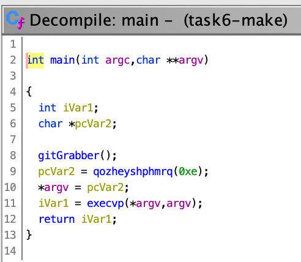
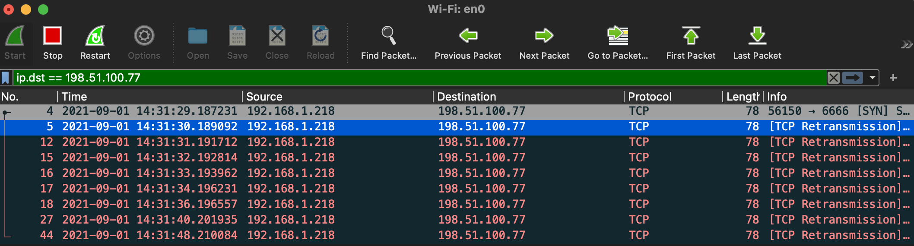
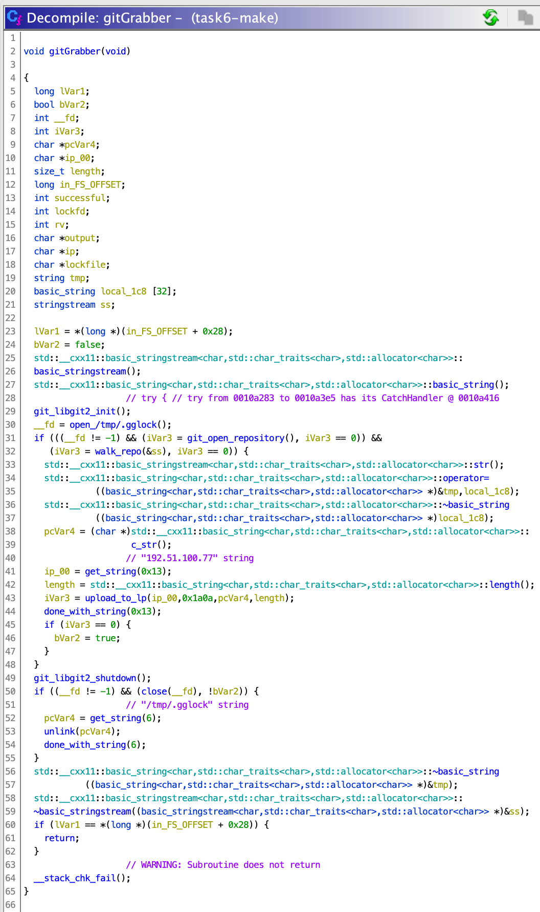
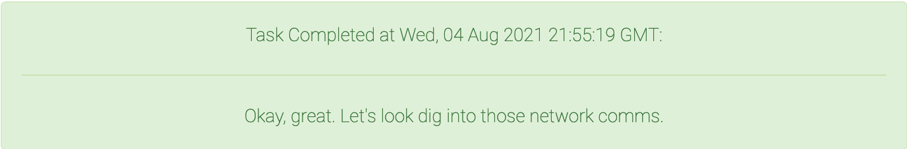

<div align="center">

# Task 6

[](https://shields.io/)
[](https://shields.io/)
</div>

> Now that we've found a malicious artifact, the next step is to understand what it's doing. Identify the file that would be created when the malicious code is run. Additionally, identify some characteristics of the communications between the malicious artifact and the LP.
> 
> ---
> 
> Enter the IP of the LP that the malicious artifact sends data to
> ```
> ```
> 
> Enter the public key of the LP (hex encoded)
> ```
> ```
> 
> Enter the version number reported by the malware
> ```
> ```

## Files

* [make](make) - Malicious `make` binary
* [Dockerfile](Dockerfile) - Dockerfile to set up debugger
* [pub.hex](pub.hex) - Public key hexdump
* [solution.txt](solution.txt) - Solution

## Solution

In this task we need to reverse the `make` binary from the last task. I'll be using [Ghidra](https://github.com/NationalSecurityAgency/ghidra) for static analyis and [GDB](https://www.gnu.org/software/gdb/) with [GEF](https://github.com/hugsy/gef) for dynamic analysis.

### Setup

#### Ghidra 

The first thing we need to do is copy the malicious `make` binary from the image. You can do this by starting the image then copying from the container's filesystem:

```bash
$ docker run --detach --rm -it panic-nightly-test:latest bash
```
```
b617744dd629e8208738b255bb76ebdb2770382fd7d453788c59076e783254f8
```
```bash
$ docker cp b617744dd629e8208738b255bb76ebdb2770382fd7d453788c59076e783254f8:/usr/bin/make ./make
```

Let's see what kind of information this binary has for us:

```bash
$ file make
```
```
make: ELF 64-bit LSB pie executable, x86-64, version 1 (SYSV), dynamically linked, interpreter /lib/ld-musl-x86_64.so.1, with debug_info, not stripped
```

This is great news. It means the binary still contains debugging symbols. If we're lucky, function names and comments will still be there! 

Let's load this into Ghidra:

<div align="center">


</div>

We found `main()`, which is good, but it does look like some obfuscation has been applied to the function names. Hopefully that doesn't cause us too much trouble. We can use the `l` key to rename functions and variables as we go. 

`main()` calls that `gitGrabber()` function, then seems to get a string from the obfuscated `qozheyshphmrq()` function which is fed into `execvp()`. Knowing what we know about how this binary works, the string passed to `execvp()` is probably `ninja`. We can confirm this with dynamic analysis!

#### GDB

I tried running the `make` binary in a Linux VM, but it failed. We could try to figure out why that is or we could just setup our dynamic analysis environment by extending the container we have from task 5 with a `Dockerfile`:

```Dockerfile
FROM panic-nightly-test:latest

# install git, gdb, and curl
RUN apk add git gdb curl
# install gef
RUN bash -c "$(curl -fsSL http://gef.blah.cat/sh)"

CMD ["gdb", "make"]
```

Then we can build it with:

```bash
$ docker build -t panic-reversing .
```
```
[+] Building 0.1s (7/7) FINISHED
...
```

And finally run it with:

```bash
$ docker --rm -it panic-reverse
```
```
GNU gdb (GDB) 10.1
Copyright (C) 2020 Free Software Foundation, Inc.
License GPLv3+: GNU GPL version 3 or later <http://gnu.org/licenses/gpl.html>
This is free software: you are free to change and redistribute it.
There is NO WARRANTY, to the extent permitted by law.
Type "show copying" and "show warranty" for details.
This GDB was configured as "x86_64-alpine-linux-musl".
Type "show configuration" for configuration details.
For bug reporting instructions, please see:
<https://www.gnu.org/software/gdb/bugs/>.
Find the GDB manual and other documentation resources online at:
    <http://www.gnu.org/software/gdb/documentation/>.

For help, type "help".
Type "apropos word" to search for commands related to "word"...
GEF for linux ready, type `gef' to start, `gef config' to configure
91 commands loaded for GDB 10.1 using Python engine 3.8
[*] 5 commands could not be loaded, run `gef missing` to know why.
Reading symbols from make...
gef➤
```

Perfect! Now we should be able to set a breakpoint at `main()` then call the obfuscated function to confirm our suspicions:

```
gef➤ b main
Breakpoint 1 at 0xa45c: file gitGrabber.cpp, line 239.
gef➤ run
...
gef➤ call qozheyshphmrq(0xe)
$1 = 0x7fcee99c6954 "ninja"
```

Nice! We were right! Looks like all of the malicious stuff will be in `gitGrabber()` so it's time to start reversing!

### Reversing Tips

Documenting my entire reversing process would take forever, so I'll just share a few tips:

1. **Rename everything**. As soon as you learn a little bit about what something does, rename it.
2. **Check for strings**. If you're stuck, try looking for strings in the *Defined Strings* window and clicking on the references to those strings.
3. **Comment everything**. It helps to leave notes for yourself throughout the process. Your function and variable names might not be enough to remind you of what you learned in previous reversing sessions. 
4. **Confirm**. If you suspect something based on the decompilation or debugger output, try to confirm it. Just like we did with the `execvp('ninja')` call. 

### LP IP

The first thing we need is the IP that this binary attempts to connect to. I tried running the binary with Wireshark listening but didn't see anything.

Let's see if we can find out where the network calls are. 

***Note:** You can highlight all instances of a variable name in Ghidra by right-clicking the variable and picking one of the Highlight options*

The binary contains references to the function `send()`. All calls to `send()` happen in the obfuscated function `gskzpmrhehvre(int sock, void *vbuf, size_t bufLen)`. We can find the socket address by finding where the `sock` argument comes from. 

This leads us to the assignment of `sock` from the call to `ddxepwqhfwlfp(ip, port)`. Now we follow the `ip` variable back to its assignment. 

The `ip` variable comes from a call to `qozheyshphmrq(0x13)`, the same function that gave us our `ninja` string. This function has variable names like `ciphertext` and `nonce`, so instead of messing with that we'll just call the function in GDB:

```
gef➤  call qozheyshphmrq(0x13)
$1 = 0x7f23b59e5954 "198.51.100.77"
```

We found the IP! But why didn't Wireshark show us anything? Recall that in Task 5, our `strace` output showed the binary attempting to read the directory `/usr/local/src/repo` but it didn't exist. What if we cloned a different git repository there by editing the Dockerfile?

```Dockerfile
RUN git clone https://github.com/hugsy/gef repo
```

Rebuilding and running `make` while listening with Wireshark shows us this:

<div align="center">


</div>

That worked! We can see that the binary is now trying to connect to the IP we found on port 6666.

### LP Public Key

We could take a similar approach here: search for the string "key" or "public", follow the references, and we'd eventually end up with the public key. However, that doesn't teach us much about the structure of the program. Instead we can try figuring out what's going on starting at `gitGrabber()`. 

I walked through some of the obfuscated functions and decoded strings until I thought I had a pretty good idea of what was going on. Here's what I ended up with:

<div align="center">


</div>

Most of the interesting stuff and the functionality most likely to contain keys is in what's now called `upload_to_lp()` (formerly `piayygmoklpek()`). 

`upload_to_lp()` looks long and complicated, but thankfully we have many clear function and variable names. We're looking for the server's public key, so we should be on the lookout for any cryptographic calls. 

While going through the obfuscated function calls in `upload_to_lp()`, right at the top of `enxlhwgevwtay(int sock string *fp)`, I noticed that there are several public key related variables like `pubKey, public_key, and client_public`. `pubKey` is the first one to be assigned with a call to `get_string(0x12)`. Let's hop over to GDB to get that string:

```
gef➤  call qozheyshphmrq(0x12)
$2 = 0x7f43678f69b4 "3)\302\021\277\023\016\221\222\254'\343\271\323.\200b\252\203voM\a.ڼT\bjWKs"
```

Hm, this is probably our key, but not in the format we want. Right after the string is fetched we can see that `pubKey` is placed into `public_key` and has a length of 32 bytes. To get this in hex, we can use GEF's `hexdump` command and then strip out the junk we don't need:

```
gef➤  hexdump byte 0x7f43678f69b4 --size 32
0x00007f43678f69b4     33 29 c2 11 bf 13 0e 91 92 ac 27 e3 b9 d3 2e 80    3)........'.....
0x00007f43678f69c4     62 aa 83 76 6f 4d 07 2e da bc 54 08 6a 57 4b 73    b..voM....T.jWKs
```

This output is copied and pasted into `pub.hex`. Then in `vim`, I copied out the middle section and removed the spaces/newlines to get our submission string:

```
3329c211bf130e9192ac27e3b9d32e8062aa83766f4d072edabc54086a574b73
```

### Version

We've already seen the version number. It's retrieved at the top of `upload_to_lp()` with a call to `get_string(0x11)`. Fetching the string in GDB gives us:

```
gef➤  call qozheyshphmrq(0x11)
$1 = 0x7f4928774954 "1.2.2.0-EAA"
```

We should have the three components we need for submission! 

<div align="center">


</div>

## Resources

* [Ghidra](https://github.com/NationalSecurityAgency/ghidra)
* [GDB](https://www.gnu.org/software/gdb/)
* [GEF](https://github.com/hugsy/gef)
