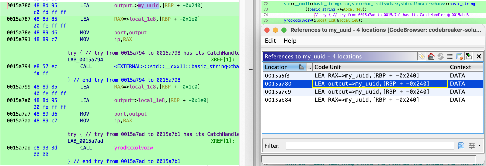
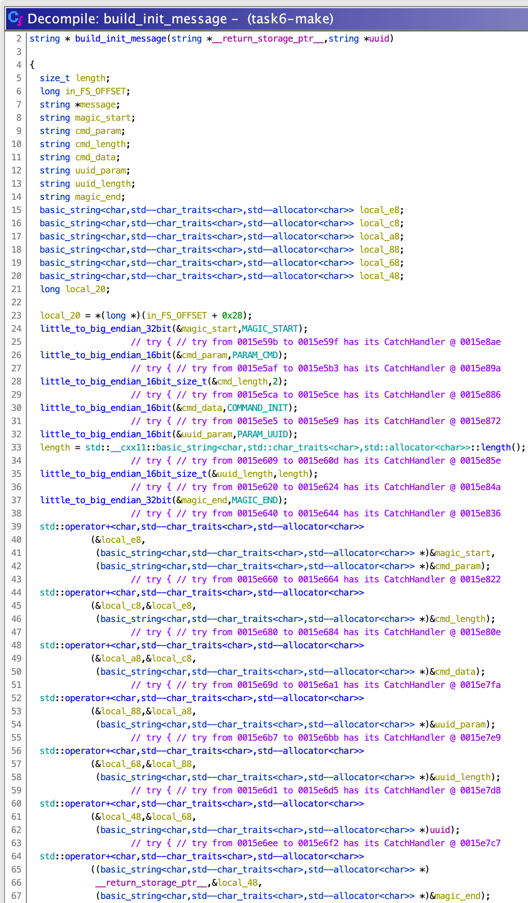
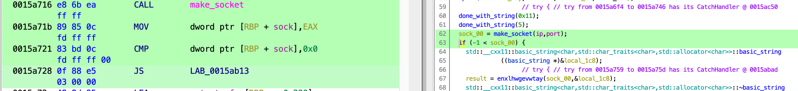
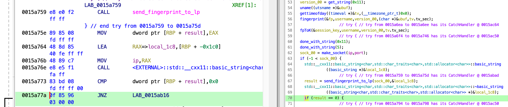

<div align="center">

# Task 7

[](https://shields.io/)
[](https://shields.io/)
[](https://shields.io/)
</div>

> With the information provided, PANIC worked with OOPS to revert their Docker image to a build prior to the compromise. Both companies are implementing additional checks to prevent a similar attack in the future.
> 
> Meanwhile, NSA's Cybersecurity Collaboration Center is working with DC3 to put together a Cybersecurity Advisory (CSA) for the rest of the DIB. DC3 has requested additional details about the techniques, tools, and targets of the cyber actor.
> 
> To get a better understanding of the techniques being used, we need to be able to connect to the listening post. Using the knowledge and material from previous tasks, analyze the protocol clients use to communicate with the LP. Our analysts believe the protocol includes an initial crypt negotiation followed by a series of client-generated requests, which the LP responds to. Provide the plaintext a client would send to initialize a new session with the provided UUID.
> 
> Downloads:
> * [Victim ID to use in initialization message (victim_id)](provided/victim_id)
> 
> ---
> 
> Provide a hex dump of the plaintext packet (not frame) contents a client would send to initialize a session with the provided UUID
> ```
> ```

## Files

* [provided/](provided/)
  - [victim_id](provided/victim_id) - Provided victim UUID
* [patched_make](patched_make) - Patched `make` binary that bypasses network functionality
* [Dockerfile](Dockerfile) - New Dockerfile that uses patched `make` binary
* [solution.txt](solution.txt) - Solution

## Solution

In this task we'll continue to reverse engineer the malicious `make` binary to learn more about the structure of messages sent to the Listening Post.

### Reversing

Last time we were reversing `upload_to_lp()` (formerly `piayygmoklpek()`). One of the defined variables already named for us was `my_uuid`. Since we're provided with a new victim UUID that we're supposed to use to generate the init message with, it makes sense to follow this `UUID` and see how it's used. 

While searching for more references to `my_uuid` in the Decompiled view, I couldn't seem to find any references to the variable beyond the call to `get_random_bytes()` (`elihuiqddkpos()`) where the UUID is populated. If this is a problem with Ghidra's decompiler, we should still see references to `my_uuid` in the disassembly view. Let's check there. 

A good way to do this is by right-clicking `RAX=>my_uuid` in the disassembly (Listing) window, then clicking *References > Show References to my_uuid*. We can see that the second reference occurs right before a call to `yrodkxxolvozw()`:

<div align="center">


</div>

Hopping into that function we can see that its second parameter is the string `uuid`! There's a lot of text in the decompiled view, but really this function is very simple. Let's reverse it a bit so that it makes more sense. 

`nhgrnvvrpcltq()` gets called a few times with the address of a string variable and some constant. This function calls `htonl` on the constant, a system call whose man page states:

> These routines convert 16 bit, 32 bit, and 64 bit quantities between network byte order and host byte order. (Network byte order is big endian, or most significant byte first.)

We can rename this function to `little_to_big_endian_32bit()`. The other calls in this section perform similar operations:

<div align="center">


</div>

After the conversions are made, the final message string is built. More readable pseudocode for this function looks like this:

```
func build_init_message(string uuid) returns string:
    length = len(uuid)

    // little -> big endian conversions
    magic_start = little_to_big(MAGIC_START)
    cmd_param = little_to_big(PARAM_CMD)
    cmd_length = little_to_big(2)
    cmd_data = little_to_big(COMMAND_INIT)
    uuid_param = little_to_big(PARAM_UUID)
    uuid_length = little_to_big(length)
    magic_end = little_to_big(MAGIC_END)

    // build string
    init_message = concat(magic_start, cmd_param)
    init_message = concat(init_message, cmd_length)
    init_message = concat(init_message, cmd_data)
    init_message = concat(init_message, uuid_param)
    init_message = concat(init_message, uuid_length)
    init_message = concat(init_message, uuid)
    init_message = concat(init_message, magic_end)

    return init_message
```

The final init message structure looks like this:

```
Total size (34 bytes)

magic_start (4)
cmd_param (2)
cmd_length (2)
cmd_data (2)
uuid_param (2)
uuid_length (2)
uuid (16)
magic_end (4)
```

Right after this function is called, `push_back(&messages, init_message)` is called, indicating that this message is probably standalone and what we need to recreate to solve this task. At this point we could grab the constants, do the endian conversion, fill in our `victim_uuid` and solve the task. Instead, I'd like to just set a breakpoint at the return from this function so it can build the string for us, then we can substitute `victim_uuid`.  

### Patching `make`

However, there's a problem. The init message doesn't get built until *after* trying to connect to the LP. That's not possible right now. To get around this we can patch the binary! We need to do two things:

1. Remove call and jmp condition around `make_socket()` inside of `upload_to_lp()`. This prevents the socket from being created. We're removing the condition *and* call because `make_socket()` will take a long time to fail if we leave it in. To remove this section we'll replace the bytes with `NOP`s (0x90).

<div align="center">


</div>

2. Change JNZ to JZ after the `send_fingerprint_to_lp()` (formerly `enxlhwgevwtay()`) returns. This function attempts to send some information to the LP, but it will fail. It fails quickly so we don't need to patch out the call. We're going to patch using `hexedit`, so we need to know *how* to change JNZ to JZ. In Ghidra we can do this by right-clicking the instruction, clicking *Patch Instruction*, then changing JNZ to JZ. Now we can see which bytes change in the leftmost column. In this case we need to change the second byte of the instruction from 0x85 to 0x84.

<div align="center">


</div>

This is a really simple patch, so my approach is just to copy the `make` binary to `patched_make`, open it in `hexedit`, search for the section I want to change, and type in the new op codes:

<div align="center">

[](https://asciinema.org/a/RFp4uwNjYZeW5ILws8I2unU44)
</div>

### Assemble Packet

We can now modify the Dockerfile from the last task to use our patched version of `make` instead:

```Dockerfile
COPY patched_make /usr/bin/make
```

Now we should be able to successfully break on `yrodkxxolvozw()` and get its return value. 

```
print *(char**) address
```

Let's build the new Docker image:

```bash
$ docker build -t panic-reversing .
```
```
[+] Building 0.1s (10/10) FINISHED
...
```

Now we can run it. We're going to set a breakpoint in `build_init_message()` (`yrodkxxolvozw()`) and run until that function is called. Then we'll jump to the exit of the function with `finish`. As a sanity check, we'll print the randomly generated 16-byte UUID. Finally we can print the init message and confirm it looks correct. Note that a C++ string is returned so it may not be obvious how to print out the true value of the string. [This Stack Overflow answer](https://stackoverflow.com/a/6778040/15117449) explains how to get the value in GDB.

```bash
$ docker run --rm -it panic-reversing
```
```
...
gef➤  b yrodkxxolvozw
Breakpoint 1 at 0x5e55f: file ggProtocol.cpp, line 49.
gef➤  run 
...
gef➤  finish
...
gef➤  p my_uuid
$2 = {
  static npos = 0xffffffffffffffff,
  _M_dataplus = {
    <std::allocator<char>> = {
      <__gnu_cxx::new_allocator<char>> = {<No data fields>}, <No data fields>},
    members of std::__cxx11::basic_string<char, std::char_traits<char>, std::allocator<char> >::_Alloc_hider:
    _M_p = 0x7f8c8b4636c0 "\361Q\023\234\030\034\375\267]\371\236\034b\021\214", <incomplete sequence \343>
  },
  _M_string_length = 0x10,
  {
    _M_local_buf = "\020\000\000\000\000\000\000\000\v\016\071\r\030K2\270",
    _M_allocated_capacity = 0x10
  }
}
gef➤  x/16xb 0x7f8c8b4636c0
0x7f8c8b4636c0:	0xf1	0x51	0x13	0x9c	0x18	0x1c	0xfd	0xb7
0x7f8c8b4636c8:	0x5d	0xf9	0x9e	0x1c	0x62	0x11	0x8c	0xe3
gef➤  x/34xb *(char **) $rax
0x7f8c8b4f6020:	0x18	0x15	0xe9	0xd3	0x11	0x00	0x00	0x02
0x7f8c8b4f6028:	0x00	0x02	0x11	0x08	0x00	0x10	0xf1	0x51
0x7f8c8b4f6030:	0x13	0x9c	0x18	0x1c	0xfd	0xb7	0x5d	0xf9
0x7f8c8b4f6038:	0x9e	0x1c	0x62	0x11	0x8c	0xe3	0xef	0x5a
0x7f8c8b4f6040:	0x80	0xcb
gef➤
```

The UUID appears where it should! Now we just have to replace this UUID with the bytes from our `victim_uuid` and we should be good to submit!

```
0x18	0x15	0xe9	0xd3	0x11	0x00	0x00	0x02
0x00	0x02	0x11	0x08	0x00	0x10	0xf1	0x51
0x13	0x9c	0x18	0x1c	0xfd	0xb7	0x5d	0xf9
0x9e	0x1c	0x62	0x11	0x8c	0xe3	0xef	0x5a
0x80	0xcb
|
| Annotate
v
MAGIC START:    18 15 e9 d3
PARAM CMD:      11 00
CMD LENGTH:     00 02
COMMAND INIT:   00 02
PARAM UUID:     11 08
UUID LENGTH:    00 10
UUID:           f1 51 13 9c 18 1c fd b7 5d f9 9e 1c 62 11 8c e3
MAGIC END:      ef 5a 80 cb
|
| Insert victim_uuid bytes
v
MAGIC START:    18 15 e9 d3
PARAM CMD:      11 00
CMD LENGTH:     00 02
COMMAND INIT:   00 02
PARAM UUID:     11 08
UUID LENGTH:    00 10
UUID:           b4 6c b9 04 26 57 41 78 84 9c ab b0 2f e4 c5 98
MAGIC END:      ef 5a 80 cb
|
| Condense
v
1815e9d311000002000211080010b46cb90426574178849cabb02fe4c598ef5a80cb
```

<div align="center">


</div>

## Resources

* [htonl(3) - Linux man page](https://linux.die.net/man/3/htonl)
* [Print C++ string in GDB](https://stackoverflow.com/a/6778040/15117449)
