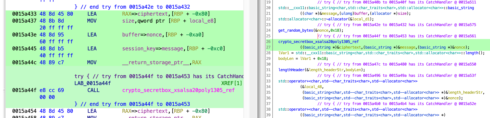
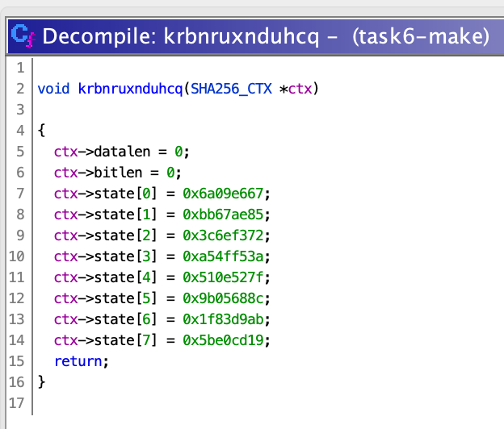
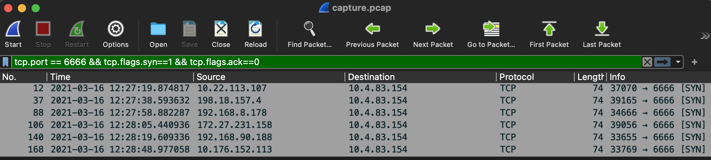
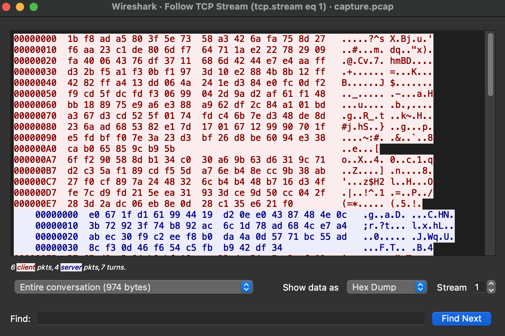

<div align="center">

# Task 8

[](https://shields.io/)
[](https://shields.io/)
[](https://shields.io/)
</div>

> Knowing the contents we'd send to initialize a new session is good progress. The next step is to uncover additional details about the protocol.
> 
> We suspect the Docker malware was specifically tailored to PANIC's image and written exclusively to steal their source code. Given that, it seems likely that the malware only contains a subset of the communications protocol supported by the LP. Our network capture does appear to have communications from other malware variants. If we could decrypt those communications, then we could analyze the underlying plaintext to recover additional details about the protocol.
> 
> As a reminder, our analysts believe the protocol includes an initial crypt negotiation followed by a series of client-generated requests, which the LP responds to.
> 
> Decrypt the other sessions captured in the PCAP. Provide the UUIDs of each of the clients associated with the DIB that registered with the LP.
> 
> ---
> 
> Provide the UUIDs of each of the clients associated with the DIB that registered with the LP, one per line
> ```
> ```

## Files

* [sanity_check.py](sanity_check.py) - Decryption test using init message from GDB session
* [names.txt](names.txt) - Username wordlist from SecLists
* [brute_force.go](brute_force.go) - Go brute-forcer
* [decrypt.py](decrypt.py) - Decrypts and parses UUIDs from sessions
* [solution.txt](solution.txt) - Solution

## Solution

We're going to do a lot in this task:

* Find a cryptographic vulnerablity in the communications between the malware sample we have and the listening post
* Use the vulnerability to crack multiple sessions we have in our PCAP
* Write a parser to understand the decrypted session info

### Vulnerability Hunting

#### `send_fingerprint_to_lp()`
Up to this point we've mostly explored the plaintext side of the protocol. In task 6 we found a public key in `send_fingerprint_to_lp()` (`enxlhwgevwtay()`), so that's probably a good place to start. It's also the first function to be called after the socket is created. 

Thankfully most things are named and that gives us a lot to work with. We see references to public and private keys, an `fp` or fingerprint, nonces, and the `send_to_lp()` function we named earlier. The most interesting line is this:

```
crypto_box_curve25519xsalsa20poly1305_ref
        ((basic_string *)&ciphertext,(basic_string *)fp,(basic_string *)&nonce,
         (basic_string *)&public_key);
```

This tells us that the fingerprint gets encrypted and the algorithm used to perform the encryption. After the ciphertext is created, the *client's* public key, a "length header", the nonce, and the ciphertext are concatenated and sent to the the LP. This is the first message that takes place, even before the init message we worked with in task 7.

Is there anything here that could be compromised? We don't know the server's private key and have no way of recovering it. Additionally, a new keypair is made each time for the client. I'm not seeing anything that will help us here. Time to move on.

#### Session Key

Back in `upload_to_lp()`, there is a variable defined at the top called `session_key`. It gets assigned in the call to `fpToK(&session_key, username, version_00, tv.tv_sec)`. This could be interesting, let's see where it gets used before we spend too much time getting into into the weeds.

`session_key` gets passed as an argument to `bsrqrvoynwffz()`, which seems to encrypt messages! It uses an encryption algorithm similar to what's found in `send_fingerprint_to_lp()`, but the symmetric version:

```
crypto_secretbox_xsalsa20poly1305_ref
        ((basic_string *)&ciphertext,(basic_string *)&message,(basic_string *)&nonce);
```

The session key doesn't appear here in Ghidra like it should, but we can see it's passed as an argument from the dissasembled view:

<div align="center">


</div>

This function returns a length header, nonce, and the ciphertext, so I'm renaming it to `encrypt_and_build_message()`. It seems to get called on each of the plaintext messages after the initial fingerprint is sent, including the init message that contains the UUIDs we need to complete this task. Let's head back to `fpToK()` to see if anything fishy is going on.

First let's understand the arguments. `username` comes from a call to [`getlogin()`](https://linux.die.net/man/3/getlogin). `version` comes from the version string we got a few tasks ago (`1.1.2.0-EAA` in our case). `timestamp` is the `tv_sec` attribute from a call to [`gettimeofday()`](https://man7.org/linux/man-pages/man2/settimeofday.2.html), which is just the "number of seconds since the Epoch". 

Then a few calls are made within the function. We can take some guesses as to what's being done:

* `jexsgikojkcvr(&lowecaseUser,username)` - Convert username to lowercase
* `...::basic_string((char *)&versionShort,(ulong)version,(allocator *)0x7)`) - Get first 7 bytes of version
* Concatenate lowercase username, "+", shortened version, "+", and timestamp

The next section is a little tricky. The call to `krbnruxnduhcq()` is weird and it's contents look like they might be hard to decipher. 

<div align="center">


</div>

However, if we look at the function parameter we can see it wants a `SHA256_CTX` type. This indicates to us that SHA-256 is involved somehow. We might be able to skip over the remaining calls and just assume that the string we have is hashed. Now it's time to confirm our findings in GDB:

```
gef➤  b fpToK
Breakpoint 1 at 0x597c7: file ggComms.cpp, line 234.
gef➤  run
...
fpToK[abi:cxx11](char const*, char const*, long)(username=0x7fb0d364ae14 "unknown", version=0x7fb0d364ae74 "1.2.2.0-EAA", timestamp=0x61302ac0)
...
gef➤  ni
gef➤  
...
$rax   : 0x00007ffcea8e0230  →  0x00007fb0d3658dc0  →  "unknown+1.2.2.0+1630546624"
...
gef➤  finish
...
gef➤  p session_key
$5 = {
  static npos = 0xffffffffffffffff,
  _M_dataplus = {
    <std::allocator<char>> = {
      <__gnu_cxx::new_allocator<char>> = {<No data fields>}, <No data fields>},
    members of std::__cxx11::basic_string<char, std::char_traits<char>, std::allocator<char> >::_Alloc_hider:
    _M_p = 0x7fb0d3658df0 "?\202\300U\302\337\301\004$!\350j#m\021\266S\024m\230\221\t`\253nSίd\336}\370"
  },
  _M_string_length = 0x20,
  {
    _M_local_buf = " \000\000\000\000\000\000\000J\206R\032\251U\000",
    _M_allocated_capacity = 0x20
  }
}
gef➤  x/32xb (char **) session_key
0x7fb0d3658df0:	0x3f	0x82	0xc0	0x55	0xc2	0xdf	0xc1	0x04
0x7fb0d3658df8:	0x24	0x21	0xe8	0x6a	0x23	0x6d	0x11	0xb6
0x7fb0d3658e00:	0x53	0x14	0x6d	0x98	0x91	0x09	0x60	0xab
0x7fb0d3658e08:	0x6e	0x53	0xce	0xaf	0x64	0xde	0x7d	0xf8
```

In this debugging session the first thing we see are the parameters to the `fpToK()` function. The username is `unknown`, which only happens when `getlogin()` returns NULL. The version and timestamp appear normal.

Next we see that as the string is built, we eventually get the final string "unknown+1.2.2.0+1630546624".

Then we return from the function and print the return variable, a string with 32 bytes. The string is dumped as hex. Now we can try getting the SHA-256 hash of the fingerprint string and see if it matches:

```bash
$ echo -n "unknown+1.2.2.0+1630546624" | sha256sum
3f82c055c2dfc1042421e86a236d11b653146d98910960ab6e53ceaf64de7df8  -
```

It does match! We've successfully reversed the session key generation function! Now let's think about how this might be a bad idea. The client is already sending a client public key to the listening post in the first message, so why couldn't the LP just use that to send its messages? 

#### Vulnerability Explained

Typically asymmetric crypto is used to exchange a symmetric key because symmetric crypto is faster. It appears that this is what's being attempted. However, the symmetric key should not be derived from information like the username, version, and timestamp because that vastly reduces the keyspace. 

We can reduce the keyspace even further because we know the timestamps from the PCAP data. We *might* have the version number if the malware authors were lazy and didn't change it. Even if they have changed the version number, 0.0.0.0-9.9.9.9 is still only 10,000 possibilities (we can only hope there aren't any multi-digit numbers). Finally, we will have to figure out the usernames. Usernames are typically short, alphanumeric strings. If we're very lucky, all of the malware will be deployed in Docker and probably have a username of `root` or `unknown`. Otherwise we can try to find username wordlists or even exhaust all possibilities for the shorter usernames (<6 characters) in a reasonable amount of time!

***Note**: This task took myself (and many other solvers) the most amount of time because it isn't immediately obvious how the search space can be reduced. Keep in mind that every session is likely from a different company with an unknown username format. In real life there's a possibility some sessions would be intractable to recover.*

### Cracking

#### Extracting Sessions from Wireshark

Before we can start trying to crack sessions, we'll need to get the session information from Wireshark. We know that the first message to the LP sends the following:

* 32 byte client public key
* Length header + nonce + ciphertext, encrypted with LP's public key

Then the second message contains:

* Length header + nonce + ciphertext, encrypted with session key

It's not guaranteed, but it is likely that we can count on port 6666 to be consistent across all of the versions. Let's go into Wireshark and try to pull out the first message encrypted with the session key. We want [all SYN packets](https://osqa-ask.wireshark.org/questions/230/displaying-all-tcp-connections-with-syn-packets/) destined for port 6666:

```
tcp.port == 6666 && tcp.flags.syn==1 && tcp.flags.ack==0
```

<div align="center">


</div>

We can see that there are 6 sessions total. Only three of these are needed for the task though, the ones with DIB addresses that we don't already have:

* 10.176.152.113
* 10.22.113.107
* 192.168.8.178

If we right-click on one of these sessions and click *Follow > TCP Stream* we can see the first messages that the client sends:

<div align="center">


</div>

We can see the first two messages from the client to the LP are sent one after another, with the second message starting at byte 0xA7. This is where the init message starts that we will need to decrypt. We can copy this packet's payload by clicking on the packet, right-clicking on *TCP payload (78 bytes)*, then clicking *Copy > ...as a Hex Stream*. 

We'll also need the timestamps so copy that too, and make sure you copy the timestamp for the SYN because the session key is generated before any information is sent to the LP. Doing this for each of our three sessions yields the following:

```
10.22.113.107, 1615897639, 6ff290588db134c030a69b63d6319c71d2c35af189cdf55da76eb48ecc9b38ab27f0cf897a2448326cb4b448b716d34ffe7cd9fd215eea31933dce9d50cc042f283d2adc06eb8e0d28c135e621f0

192.168.8.178, 1615897678, 30ebcf5f20a6d7d06d31c233560d18f13330be17ff8e896c5d61fde2644345cc997c9c627494423b042d545bf6f102a7f10f9b5856c83f49553d1a9cd0661c0d56b435459b046e571f488321f56c

10.176.152.113, 1615897728, f5560af46f120876788160addb65aeb3cf365b038567a0302dcb0b377dd70873087e773db76687ce213db432d12c893437bb93a71900c423d707c118695fbd74bd45a713a2f09e1bff87da54e3e9
```

#### Sanity Check

As a sanity check before we start trying to crack these blindly, let's run GDB again and see if we can extract the encrypted init message and try to decrypt it knowing the key. 

```
gef➤  b fpToK
Breakpoint 1 at 0x597c7: file ggComms.cpp, line 234.
gef➤  run
...
[#0] 0x55c3b1ca17c7 → fpToK[abi:cxx11](char const*, char const*, long)(username=0x7f64f0d63e14 "unknown", version=0x7f64f0d63e74 "1.2.2.0-EAA", timestamp=0x6130e54a)
...
gef➤  b bsrqrvoynwffz
Breakpoint 2 at 0x55c3b1ca23ce: file ggComms.cpp, line 362.
gef➤  c
...
gef➤  finish
...
gef➤  p *(std::string *) $rax
$7 = {
  static npos = 0xffffffffffffffff,
  _M_dataplus = {
    <std::allocator<char>> = {
      <__gnu_cxx::new_allocator<char>> = {<No data fields>}, <No data fields>},
    members of std::__cxx11::basic_string<char, std::char_traits<char>, std::allocator<char> >::_Alloc_hider:
    _M_p = 0x7f64f0d63a50 "\233\355d]\245t'\250\066\205\270\027\025\026\220\265P\202\341]\020\306\303\324\377\234\017\226\321\373ّ\024+\030:\017\217\225'A\330h\035.\271\243\304\005*\235S\237M@\207\017\213\030Y\274\006\340\366\035\237<\357\025R8\253\351\036\254\244\256", <incomplete sequence \322>
  },
  _M_string_length = 0x4e,
  {
    _M_local_buf = "N\000\000\000\000\000\000\000\000\a\357Z\200\313\000",
    _M_allocated_capacity = 0x4e
  }
}
gef➤  x/78xb 0x7f64f0d63a50
0x7f64f0d63a50:	0x9b	0xed	0x64	0x5d	0xa5	0x74	0x27	0xa8
0x7f64f0d63a58:	0x36	0x85	0xb8	0x17	0x15	0x16	0x90	0xb5
0x7f64f0d63a60:	0x50	0x82	0xe1	0x5d	0x10	0xc6	0xc3	0xd4
0x7f64f0d63a68:	0xff	0x9c	0x0f	0x96	0xd1	0xfb	0xd9	0x91
0x7f64f0d63a70:	0x14	0x2b	0x18	0x3a	0x0f	0x8f	0x95	0x27
0x7f64f0d63a78:	0x41	0xd8	0x68	0x1d	0x2e	0xb9	0xa3	0xc4
0x7f64f0d63a80:	0x05	0x2a	0x9d	0x53	0x9f	0x4d	0x40	0x87
0x7f64f0d63a88:	0x0f	0x8b	0x18	0x59	0xbc	0x06	0xe0	0xf6
0x7f64f0d63a90:	0x1d	0x9f	0x3c	0xef	0x15	0x52	0x38	0xab
0x7f64f0d63a98:	0xe9	0x1e	0xac	0xa4	0xae	0xd2
```

We should be able to decrypt this payload using the key `unknown+1.2.2.0+1630594378`. Let's try it in Python for now, but we'll implement our final brute-forcer in Go later on so it's **fast**. 

It was a little tricky to find the proper cryptographic library in Python, but if we search for `crypto_secretbox_xsalsa20poly1305_ref` online we can find that this comes from the [NaCl: Networking and Cryptography library](https://nacl.cr.yp.to/secretbox.html). If we search for *python nacl library* we find [PyNaCl](https://pynacl.readthedocs.io/en/latest/)! Let's try using this library and see if it works.

***Note**: I used the `slownacl` library when solving this task. It required some modifications before it would work, which is why I'm not using it in this write-up. I didn't discover PyNaCl until after completing the challenge.*  

```python3
#!/usr/bin/env python3

import nacl.secret
import hashlib

# message from GDB session
message = bytes.fromhex('9bed645da57427a83685b817151690b55082e15d10c6c3d4ff9c0f96d1fbd991142b183a0f8f952741d8681d2eb9a3c4052a9d539f4d40870f8b1859bc06e0f61d9f3cef155238abe91eaca4aed2')

# make key by hashing username, version, timestamp
def keygen(username, version, timestamp):
    keystring = f'{username}+{version}+{str(timestamp)}'

    h = hashlib.sha256()
    h.update(f'{username}+{version}+{str(timestamp)}'.encode())

    return h.digest()

# make key from known username, shortened version, and timestamp
key = keygen("unknown", "1.2.2.0", 1630594378)

# parse message
header = message[:4]
nonce = message[4:28]
ciphertext = message[28:]

# make box from key
box = nacl.secret.SecretBox(key)

# try to decrypt
try:
    plaintext = box.decrypt(nonce + ciphertext)
    print("SUCCESS:", plaintext)
except Exception as e:
    print("FAILURE:", e)
```

Running this works!

```bash
$ python3 sanity_check.py
```
```
SUCCESS: b"\x18\x15\xe9\xd3\x11\x00\x00\x02\x00\x02\x11\x08\x00\x10\x80B\xc2\x9f\x95|F%\xd0\xfc'\xdb\xd6\xd6,<\xefZ\x80\xcb"
```

Nice! Now we can write a brute-forcer using this technique.

#### Parallelized Brute-Forcer

Learning from the many mistakes I made attempting to solve this challenge, we're going to write a very fast brute-forcer that recovers all three sessions in just a couple of minutes. Just for fun, we'll do it in [Go](https://golang.org/).

My first brute-forcer used Python and recovered one of the sessions fairly quickly. The fingerprint for the session was:

```
root+1.2.2.0+1615897678
```

I got this by getting a short list of the most common usernames, not modifying the version, and giving the timestamp a margin of +- 1. After this I was stuck for several days. I tried adjusting the timestamp margin to +- 3, adjusting the version numbers between 0.0.0.0 and 3.3.3.3, and running through many username wordlists and exhaustive searches for short usernames. 

I saw that a few people had gotten useful hints from the organizers, so I reached out and told them what I had tried. They said I was on the right track with wordlists, which gave me the confidence to optimize my brute-forcer and widen the margins for my version number to 0.0.0.0 through 9.9.9.9 on top of the timestamp margin and gigantic wordlists. You can find it in [brute_force.go](brute_force.go), here's the roadmap:

* On init, a slice of Messages gets populated from the packet information
* The file containing usernames is opened
* Goroutines are spawned for each CPU, think of these as workers
* Username file is read line-by-line. Each username is sent to a worker channel for the workers to consume
* Workers try to crack every uncracked session by iterating over version numbers 0.0.0.0-9.9.9.9 and the timestamp of each session +- 1
* Once a message is cracked, it's removed from the message slice to speed up the rest of the process

There are many wordlists out there, but [SecLists](https://github.com/danielmiessler/SecLists) are very popular so they seem like a safe option (not to mention this repository is linked on the [Codebreaker Resources](https://nsa-codebreaker.org/resources) page). *SecLists / Usernames / Names / names.txt* contains all of the usernames needed to crack the three sessions we need and it's only ~70KB! 

Running this script on my 2018 MacBook Pro with a 2.6 GHz 6-Core Intel Core i7 cracks all three sessions in about a minute and a half:

***Note**: I upgraded to a 2021 M1 MacBook Pro and ran this again. It found all three solutions in half the time.*

<div align="center">

[](https://asciinema.org/a/GcesiqBm2ZZAYm9WIMpNWHhD0)
</div>

Awesome! We have the keys for all three sessions:

```
chickie+2.7.5.7+1615897729
root+1.2.2.0+1615897678
sayre+1.6.7.9+1615897640
```

### Parsing

Now we can parse the init message to get the UUIDs. We'll hold off on writing a generic parser until the next task. This should be very simple:

```python3
#!/usr/bin/env python3

import nacl.secret
import uuid
import hashlib

# hash fingerprint
def keygen(fp):
    h = hashlib.sha256()
    h.update(fp.encode())
    return h.digest()

# decrypt message
def decrypt(ciphertext, nonce, key):
    box = nacl.secret.SecretBox(key)
    return box.decrypt(nonce + ciphertext)

# cracked fingerprints
fingerprints = [
    "sayre+1.6.7.9+1615897640",
    "root+1.2.2.0+1615897678",
    "chickie+2.7.5.7+1615897729",
]

# build messages list from PCAP
messages = []
messages.append(bytes.fromhex('6ff290588db134c030a69b63d6319c71d2c35af189cdf55da76eb48ecc9b38ab27f0cf897a2448326cb4b448b716d34ffe7cd9fd215eea31933dce9d50cc042f283d2adc06eb8e0d28c135e621f0'))
messages.append(bytes.fromhex('30ebcf5f20a6d7d06d31c233560d18f13330be17ff8e896c5d61fde2644345cc997c9c627494423b042d545bf6f102a7f10f9b5856c83f49553d1a9cd0661c0d56b435459b046e571f488321f56c'))
messages.append(bytes.fromhex('f5560af46f120876788160addb65aeb3cf365b038567a0302dcb0b377dd70873087e773db76687ce213db432d12c893437bb93a71900c423d707c118695fbd74bd45a713a2f09e1bff87da54e3e9'))

uuids = []
for i, m in enumerate(messages):
    print(f"{'=' * 4} {fingerprints[i]}")
    
    # parse encrypted message
    length = m[:4]
    nonce = m[4:28]
    ciphertext = m[28:]
    key = keygen(fingerprints[i])

    # decrypt message
    p = decrypt(ciphertext, nonce, key)

    # print init message fields
    print(f"MAGIC START: {p[:4]}") 

    # CMD
    print(f"CMD PARAM: {p[4:6]}") 
    print(f"CMD LENGTH: {p[6:8]}") 
    print(f"CMD DATA: {p[8:10]}") 

    # UUID
    print(f"UUID PARAM: {p[10:12]}") 
    print(f"UUID LENGTH: {p[12:14]}") 
    print(f"UUID: {p[14:30]}") 
    
    # parse UUID
    u = uuid.UUID(bytes=p[14:30])
    uuids.append(u)

    print(f"MAGIC END: {p[30:34]}") 
    print()

# print all UUIDs for submission
print(f"{'=' * 4} UUIDs")
for u in uuids: print(u)
```

```bash
python3 decrypt.py
```
```
==== sayre+1.6.7.9+1615897640
MAGIC START: b'\x18\x15\xe9\xd3'
CMD PARAM: b'\x11\x00'
CMD LENGTH: b'\x00\x02'
CMD DATA: b'\x00\x02'
UUID PARAM: b'\x11\x08'
UUID LENGTH: b'\x00\x10'
UUID: b'\x9f\xb1\x13\xfd\x7f,K\xa0\xb5\x8b\xe4A\xb9-v\x00'
MAGIC END: b'\xefZ\x80\xcb'

==== root+1.2.2.0+1615897678
MAGIC START: b'\x18\x15\xe9\xd3'
CMD PARAM: b'\x11\x00'
CMD LENGTH: b'\x00\x02'
CMD DATA: b'\x00\x02'
UUID PARAM: b'\x11\x08'
UUID LENGTH: b'\x00\x10'
UUID: b'\xb6\xc5\x95\x7fB\xffG:\x85\xe2\x92\x89G|\x12\t'
MAGIC END: b'\xefZ\x80\xcb'

==== chickie+2.7.5.7+1615897729
MAGIC START: b'\x18\x15\xe9\xd3'
CMD PARAM: b'\x11\x00'
CMD LENGTH: b'\x00\x02'
CMD DATA: b'\x00\x02'
UUID PARAM: b'\x11\x08'
UUID LENGTH: b'\x00\x10'
UUID: b'?\xe9zE&\xeaC\xd5\xaa!\xefU\xa1\xa4\xce\xd8'
MAGIC END: b'\xefZ\x80\xcb'

==== UUIDs
9fb113fd-7f2c-4ba0-b58b-e441b92d7600
b6c5957f-42ff-473a-85e2-9289477c1209
3fe97a45-26ea-43d5-aa21-ef55a1a4ced8
```

<div align="center">


</div>

## Resources

* [getlogin(3) - Linux man page](https://linux.die.net/man/3/getlogin)
* [gettimeofday(2) - Linux manual page](https://man7.org/linux/man-pages/man2/settimeofday.2.html)
* [Wireshark SYN Filter](https://osqa-ask.wireshark.org/questions/230/displaying-all-tcp-connections-with-syn-packets/)
* [NaCl: Networking and Cryptography library](https://nacl.cr.yp.to/secretbox.html)
* [Go](https://golang.org/)
* [SecLists](https://github.com/danielmiessler/SecLists)
